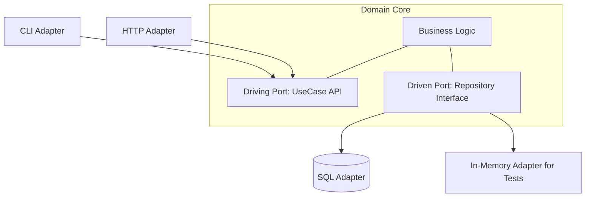
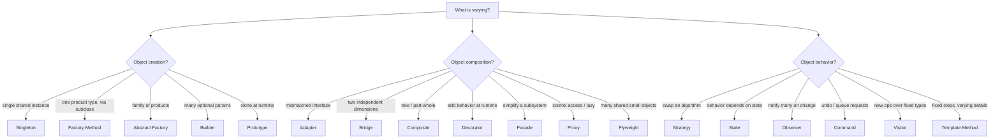

# Design Patterns in C++ -- Comprehensive Reference

> A deep-dive, interview-focused reference covering software design patterns with idiomatic, modern C++ (C++11 through C++20). Covers the design principles behind patterns, all 23 Gang of Four (GoF) patterns, C++-specific idioms (RAII, CRTP, pImpl, type erasure, policy-based design), and architectural and concurrency patterns. Each section includes intent, structure, runnable code, trade-offs, common pitfalls, and interview questions. Complements the *C++ Fundamentals*, *CS Fundamentals*, and *DSA Fundamentals* guides.

---

## Table of Contents

### Part 1: Foundations

1. [What Design Patterns Are (and Are Not)](#1-what-design-patterns-are-and-are-not)
2. [Design Principles: SOLID and Beyond](#2-design-principles-solid-and-beyond)
3. [Pattern Categories and How to Choose](#3-pattern-categories-and-how-to-choose)

### Part 2: Creational Patterns

4. [Singleton](#4-singleton)
5. [Factory Method](#5-factory-method)
6. [Abstract Factory](#6-abstract-factory)
7. [Builder](#7-builder)
8. [Prototype](#8-prototype)

### Part 3: Structural Patterns

9. [Adapter](#9-adapter)
10. [Bridge](#10-bridge)
11. [Composite](#11-composite)
12. [Decorator](#12-decorator)
13. [Facade](#13-facade)
14. [Flyweight](#14-flyweight)
15. [Proxy](#15-proxy)

### Part 4: Behavioral Patterns

16. [Chain of Responsibility](#16-chain-of-responsibility)
17. [Command](#17-command)
18. [Interpreter](#18-interpreter)
19. [Iterator](#19-iterator)
20. [Mediator](#20-mediator)
21. [Memento](#21-memento)
22. [Observer](#22-observer)
23. [State](#23-state)
24. [Strategy](#24-strategy)
25. [Template Method](#25-template-method)
26. [Visitor](#26-visitor)

### Part 5: Idiomatic Modern C++ Patterns

27. [RAII -- Resource Acquisition Is Initialization](#27-raii-resource-acquisition-is-initialization)
28. [CRTP -- Curiously Recurring Template Pattern](#28-crtp-curiously-recurring-template-pattern)
29. [pImpl -- Pointer to Implementation](#29-pimpl-pointer-to-implementation)
30. [Rule of 0/3/5 and Copy-and-Swap](#30-rule-of-035-and-copy-and-swap)
31. [Type Erasure](#31-type-erasure)
32. [Policy-Based Design and Tag Dispatch](#32-policy-based-design-and-tag-dispatch)
33. [NVI -- Non-Virtual Interface](#33-nvi-non-virtual-interface)

### Part 6: Architectural Patterns

34. [MVC, MVP, and MVVM](#34-mvc-mvp-and-mvvm)
35. [Layered and Hexagonal Architecture](#35-layered-and-hexagonal-architecture)
36. [Repository Pattern](#36-repository-pattern)
37. [Dependency Injection and IoC](#37-dependency-injection-and-ioc)
38. [Event-Driven and Publish-Subscribe](#38-event-driven-and-publish-subscribe)

### Part 7: Concurrency Patterns

39. [Producer-Consumer](#39-producer-consumer)
40. [Thread Pool](#40-thread-pool)
41. [Active Object](#41-active-object)
42. [Monitor Object](#42-monitor-object)
43. [Future/Promise](#43-futurepromise)
44. [Reactor](#44-reactor)
45. [Actor Model](#45-actor-model)

### Part 8: Quick Reference

46. [Pattern Cheat Sheet](#46-pattern-cheat-sheet)
47. [Anti-Patterns](#47-anti-patterns)
48. [Decision Guide](#48-decision-guide)

---

# Part 1: Foundations

---

# 1. What Design Patterns Are (and Are Not)

A **design pattern** is a named, reusable solution to a commonly recurring problem in software design within a given context. Patterns are *descriptions* of how to structure objects and their interactions -- not copy-paste code, not libraries, and not finished designs. They were popularized by the 1994 book *Design Patterns: Elements of Reusable Object-Oriented Software* by the "Gang of Four" (Gamma, Helm, Johnson, Vlissides).

**What a pattern gives you:**

- A shared vocabulary ("use a Strategy here") that compresses design discussions.
- A proven structure with documented trade-offs and consequences.
- Guidance on which parts of a design should vary independently.

**What a pattern is *not*:**

- A goal in itself. Patterns are tools; applying them where they are not needed adds accidental complexity ("patternitis").
- Language-agnostic boilerplate. Many GoF patterns exist to work around limitations of 1990s C++/Java. In modern C++, language features (lambdas, `std::function`, templates, `std::variant`) often subsume a pattern's intent with less code.

| Term | Meaning |
|---|---|
| **Idiom** | A low-level, language-specific pattern (e.g. RAII, copy-and-swap in C++). |
| **Design pattern** | A mid-level solution to an object-interaction problem (GoF). |
| **Architectural pattern** | A high-level structure for an entire system (MVC, layered, hexagonal). |
| **Anti-pattern** | A common "solution" that looks helpful but causes more harm than good. |

**The single most important question:** before reaching for a pattern, ask *"what is varying, and how do I isolate that variation?"* Every GoF pattern is fundamentally about encapsulating a specific axis of change.

---

# 2. Design Principles: SOLID and Beyond

Patterns are applications of deeper principles. Understanding the principles lets you *derive* patterns rather than memorize them.

## 2.1 SOLID

| Principle | Statement | C++ application |
|---|---|---|
| **S** -- Single Responsibility | A class should have one reason to change. | Split a `God` class into focused types; separate parsing from I/O from business logic. |
| **O** -- Open/Closed | Open for extension, closed for modification. | Add behavior via new derived classes or template policies, not by editing existing `switch` statements. |
| **L** -- Liskov Substitution | Subtypes must be usable through the base interface without surprises. | A derived class must not strengthen preconditions or weaken postconditions; avoid `throw` on overrides the base promised wouldn't. |
| **I** -- Interface Segregation | Many small interfaces beat one fat one. | Prefer small abstract base classes / concepts over a monolithic interface clients only partly use. |
| **D** -- Dependency Inversion | Depend on abstractions, not concretions. | High-level modules take an abstract `Logger&`/`std::function`, not a concrete `FileLogger`. |

## 2.2 Other key principles

- **Composition over inheritance.** Prefer assembling behavior from member objects over deep inheritance hierarchies. Inheritance is the tightest coupling in the language. Patterns like Strategy, Decorator, and Bridge are composition in disguise.
- **Program to an interface, not an implementation.** Clients should depend on an abstract type so concrete types can be swapped.
- **Encapsulate what varies.** Identify the aspect that changes and isolate it behind a stable interface.
- **Law of Demeter ("don't talk to strangers").** A method should call methods of: itself, its parameters, objects it creates, and its direct members -- avoid `a.getB().getC().doThing()` chains.
- **DRY** (Don't Repeat Yourself) and **YAGNI** (You Aren't Gonna Need It): balance abstraction against speculative generality.

```cpp
// Dependency Inversion in practice: depend on an abstraction.
struct ILogger {
    virtual void log(std::string_view msg) = 0;
    virtual ~ILogger() = default;
};

class OrderService {
    ILogger& logger_;                 // depends on abstraction, not FileLogger
public:
    explicit OrderService(ILogger& logger) : logger_(logger) {}
    void place() { logger_.log("order placed"); }
};
```

---

# 3. Pattern Categories and How to Choose

The GoF patterns split into three families by **what they organize**:

| Category | Concern | Patterns |
|---|---|---|
| **Creational** | *How objects are created* -- decouple construction from use. | Singleton, Factory Method, Abstract Factory, Builder, Prototype |
| **Structural** | *How objects are composed* into larger structures. | Adapter, Bridge, Composite, Decorator, Facade, Flyweight, Proxy |
| **Behavioral** | *How objects communicate* and distribute responsibility. | Chain of Responsibility, Command, Interpreter, Iterator, Mediator, Memento, Observer, State, Strategy, Template Method, Visitor |

**Quick selection heuristics:**

- Need to vary *which concrete object* is created? -> Factory Method / Abstract Factory.
- Need to vary *an algorithm* at runtime? -> Strategy.
- Need to vary *behavior with internal state*? -> State.
- Need to *add responsibilities dynamically*? -> Decorator.
- Need to *make incompatible interfaces work together*? -> Adapter.
- Need to *notify many objects of change*? -> Observer.
- Need to *separate an abstraction from its implementation* so both vary? -> Bridge.

**Modern C++ caveat:** evaluate whether a lambda, `std::function`, template, `std::variant`, or standard library facility already solves the problem before introducing a class hierarchy.

# Part 2: Creational Patterns

---

# 4. Singleton

**Intent:** Ensure a class has exactly one instance and provide a global access point to it.

**When to use:** A genuinely single shared resource -- a logging sink, a configuration registry, a hardware device handle. Use sparingly: Singletons are global state and complicate testing and lifetime.

**Modern C++ implementation -- the Meyers' Singleton.** A function-local `static` is initialized exactly once, lazily, and is thread-safe since C++11 (the standard guarantees the initialization is synchronized).

```cpp
class Logger {
public:
    static Logger& instance() {
        static Logger inst;   // thread-safe, lazy, destroyed at program exit
        return inst;
    }

    void log(std::string_view msg) { /* ... */ }

    // Forbid copying/moving so the single instance can't be duplicated.
    Logger(const Logger&) = delete;
    Logger& operator=(const Logger&) = delete;

private:
    Logger() = default;
    ~Logger() = default;
};

// usage
Logger::instance().log("started");
```

**Trade-offs and pitfalls:**

- **Hidden dependencies / testability.** Code that calls `Logger::instance()` has an invisible dependency that's hard to mock. Prefer injecting an `ILogger&` (Dependency Inversion) and reserve the Singleton for the composition root.
- **Static initialization order fiasco.** A non-local static in translation unit A that uses a non-local static in B has undefined init order. The Meyers' Singleton sidesteps this because initialization happens on first call.
- **Destruction order.** Function-local statics are destroyed in reverse order of completion of their construction; a Singleton using another during destruction can crash. The "Nifty Counter" / Schwarz counter idiom or leaking the instance intentionally avoids this.

| Approach | Thread-safe | Lazy | Notes |
|---|---|---|---|
| Meyers' (`static` local) | Yes (C++11+) | Yes | Preferred default |
| `std::call_once` + `std::once_flag` | Yes | Yes | More verbose; useful for complex init |
| Eager global object | Depends | No | Subject to init-order fiasco |

---

# 5. Factory Method

**Intent:** Define an interface for creating an object, but let subclasses decide which class to instantiate. Defers instantiation to subclasses.

**When to use:** A class can't anticipate the class of objects it must create, or you want subclasses to specify the created objects.

```cpp
struct Button { virtual void render() = 0; virtual ~Button() = default; };
struct WinButton : Button { void render() override { /* ... */ } };
struct MacButton : Button { void render() override { /* ... */ } };

class Dialog {
public:
    // The "factory method" -- overridden by subclasses.
    virtual std::unique_ptr<Button> createButton() = 0;

    void render() {                       // template-method-style use of the factory
        auto button = createButton();
        button->render();
    }
    virtual ~Dialog() = default;
};

class WinDialog : public Dialog {
    std::unique_ptr<Button> createButton() override {
        return std::make_unique<WinButton>();
    }
};
```

**Factory Method vs. a simple factory function.** A free function `make_button(Os)` that `switch`es is a *simple factory* (not a GoF pattern, but common and often sufficient). Factory Method specifically uses **polymorphism + inheritance** so the choice is encoded by the subclass, not a runtime tag.

**Pitfalls:** Returning raw pointers leaks ownership intent -- always return `std::unique_ptr<Base>`. A `switch` that grows with every new type violates Open/Closed; consider a registry (map from key to creator `std::function`).

---

# 6. Abstract Factory

**Intent:** Provide an interface for creating *families* of related objects without specifying their concrete classes.

**When to use:** Your system must be configured with one of multiple families of products that are designed to be used together (e.g. a UI toolkit producing matching `Button`, `Checkbox`, `Scrollbar` for one OS theme).

```cpp
struct Button   { virtual ~Button() = default; };
struct Checkbox { virtual ~Checkbox() = default; };

struct WinButton : Button {}; struct WinCheckbox : Checkbox {};
struct MacButton : Button {}; struct MacCheckbox : Checkbox {};

// Abstract factory: one method per product in the family.
struct GuiFactory {
    virtual std::unique_ptr<Button>   createButton()   = 0;
    virtual std::unique_ptr<Checkbox> createCheckbox() = 0;
    virtual ~GuiFactory() = default;
};

struct WinFactory : GuiFactory {
    std::unique_ptr<Button>   createButton()   override { return std::make_unique<WinButton>(); }
    std::unique_ptr<Checkbox> createCheckbox() override { return std::make_unique<WinCheckbox>(); }
};

void buildUi(GuiFactory& f) {            // client codes against the abstraction only
    auto btn = f.createButton();
    auto chk = f.createCheckbox();
}
```

**Factory Method vs Abstract Factory:** Factory Method creates *one* product via inheritance; Abstract Factory creates a *family* of products and is usually composed (the factory is an object you pass around). Abstract Factory is often *implemented using* several Factory Methods.

**Pitfall:** Adding a new product *type* to the family forces a change to every factory -- the pattern favors adding new *families* over new *product kinds*.

---

# 7. Builder

**Intent:** Separate the construction of a complex object from its representation so the same construction process can create different representations. Particularly good for objects with many optional parameters.

**When to use:** Telescoping constructors (many overloads) or long parameter lists where many arguments are optional or share a type (easy to transpose).

```cpp
class HttpRequest {
public:
    class Builder;
    // ... accessors ...
private:
    std::string url_, method_ = "GET", body_;
    std::map<std::string, std::string> headers_;
    int timeout_ms_ = 30000;
    friend class Builder;
    HttpRequest() = default;
};

class HttpRequest::Builder {
    HttpRequest req_;
public:
    explicit Builder(std::string url) { req_.url_ = std::move(url); }
    Builder& method(std::string m)   { req_.method_ = std::move(m); return *this; }
    Builder& header(std::string k, std::string v) { req_.headers_[std::move(k)] = std::move(v); return *this; }
    Builder& body(std::string b)     { req_.body_ = std::move(b); return *this; }
    Builder& timeout(int ms)         { req_.timeout_ms_ = ms; return *this; }
    HttpRequest build() { return std::move(req_); }   // optionally validate here
};

// Fluent usage -- readable and order-independent for optionals.
auto req = HttpRequest::Builder("https://api.example.com")
               .method("POST")
               .header("Content-Type", "application/json")
               .body(R"({"x":1})")
               .timeout(5000)
               .build();
```

**Director (optional):** A separate `Director` can encapsulate a fixed construction recipe and drive the builder, so the same steps produce different products with different builders.

**Modern alternatives:** Designated initializers (C++20) and aggregate-with-defaults structs cover many "many optional fields" cases without a builder:

```cpp
struct WindowConfig { int width = 800, height = 600; bool fullscreen = false; };
WindowConfig cfg{ .width = 1920, .height = 1080 };   // C++20 designated initializers
```

---

# 8. Prototype

**Intent:** Create new objects by copying an existing prototype rather than constructing from scratch -- useful when construction is expensive or the concrete type is known only at runtime.

**When to use:** You hold a `Base*`/`Base&` and need a copy of the *actual* dynamic type (the classic "virtual copy constructor" problem, since constructors can't be virtual).

```cpp
struct Shape {
    virtual std::unique_ptr<Shape> clone() const = 0;   // virtual constructor idiom
    virtual void draw() const = 0;
    virtual ~Shape() = default;
};

struct Circle : Shape {
    double r;
    explicit Circle(double r) : r(r) {}
    std::unique_ptr<Shape> clone() const override {
        return std::make_unique<Circle>(*this);          // copy the real type
    }
    void draw() const override { /* ... */ }
};

void duplicate(const Shape& s) {
    auto copy = s.clone();   // gets a Circle even though we only see Shape&
}
```

**Pitfalls:** Deep vs shallow copy -- if the object owns pointers, `clone()` must deep-copy. A **prototype registry** (map from key to a prototype instance) lets you spawn configured objects by name.

# Part 3: Structural Patterns

---

# 9. Adapter

**Intent:** Convert the interface of a class into another interface clients expect, letting otherwise-incompatible classes work together. Also called Wrapper.

**When to use:** You want to use an existing class but its interface doesn't match what your code needs (often a third-party or legacy type).

```cpp
// Target interface our code expects.
struct Renderer { virtual void drawLine(int x1,int y1,int x2,int y2) = 0; virtual ~Renderer() = default; };

// Adaptee: a library with an incompatible API we cannot change.
struct LegacyGraphics { void line(Point a, Point b); };

// Object adapter: holds an instance and translates calls (composition).
class GraphicsAdapter : public Renderer {
    LegacyGraphics legacy_;
public:
    void drawLine(int x1,int y1,int x2,int y2) override {
        legacy_.line({x1,y1}, {x2,y2});   // translate the call
    }
};
```

**Object adapter (composition) vs class adapter (multiple/private inheritance):** The object adapter is preferred in C++ because it's more flexible and avoids the rigidity of inheriting from the adaptee. A class adapter uses `private` inheritance from the adaptee plus public inheritance from the target.

**Adapter vs Decorator vs Proxy:** Adapter *changes* an interface; Decorator *adds behavior* keeping the same interface; Proxy keeps the same interface to *control access*.

---

# 10. Bridge

**Intent:** Decouple an abstraction from its implementation so the two can vary independently. Replaces a combinatorial inheritance explosion with two orthogonal hierarchies connected by composition.

**When to use:** You have two (or more) independent dimensions of variation -- e.g. `Shape` x `Renderer`. Inheritance would force `RasterCircle`, `VectorCircle`, `RasterSquare`, ... (N x M classes). Bridge gives N + M.

```cpp
// Implementation hierarchy (the "bridge" target).
struct DrawingApi {
    virtual void drawCircle(double x,double y,double r) = 0;
    virtual ~DrawingApi() = default;
};
struct RasterApi : DrawingApi { void drawCircle(double,double,double) override {/*...*/} };
struct VectorApi : DrawingApi { void drawCircle(double,double,double) override {/*...*/} };

// Abstraction hierarchy holds a pointer to the implementation.
class Shape {
protected:
    DrawingApi& api_;
public:
    explicit Shape(DrawingApi& api) : api_(api) {}
    virtual void draw() = 0;
    virtual ~Shape() = default;
};

class Circle : public Shape {
    double x_, y_, r_;
public:
    Circle(DrawingApi& api,double x,double y,double r) : Shape(api), x_(x), y_(y), r_(r) {}
    void draw() override { api_.drawCircle(x_, y_, r_); }   // delegate across the bridge
};
```

**Bridge vs Strategy:** Structurally similar (both delegate to an interface), but intent differs: Bridge is a *structural* decision spanning two whole hierarchies that vary independently; Strategy is a *behavioral* swap of one algorithm. Bridge is decided at design time; Strategy often at runtime.

---

# 11. Composite

**Intent:** Compose objects into tree structures to represent part-whole hierarchies, letting clients treat individual objects and compositions uniformly.

**When to use:** Recursive tree structures -- filesystem (files/directories), GUI widgets (controls/containers), scene graphs, arithmetic expressions.

```cpp
struct FsNode {
    virtual int size() const = 0;            // uniform interface for leaf and composite
    virtual ~FsNode() = default;
};

struct File : FsNode {                        // leaf
    int bytes;
    explicit File(int b) : bytes(b) {}
    int size() const override { return bytes; }
};

struct Directory : FsNode {                    // composite
    std::vector<std::unique_ptr<FsNode>> children;
    void add(std::unique_ptr<FsNode> n) { children.push_back(std::move(n)); }
    int size() const override {
        int total = 0;
        for (const auto& c : children) total += c->size();  // recurse uniformly
        return total;
    }
};
```

**Design choice:** Where to put `add`/`remove`? Putting them in the base type gives transparency (uniform interface) but lets clients call `add` on a leaf (must error). Putting them only in `Directory` is type-safe but loses uniformity. Prefer the safe variant unless transparency is essential.

---

# 12. Decorator

**Intent:** Attach additional responsibilities to an object dynamically. A flexible alternative to subclassing for extending behavior.

**When to use:** You need to add combinations of optional behaviors at runtime (e.g. a stream that can be buffered, encrypted, and compressed in any combination). Subclassing would need a class per combination.

```cpp
struct DataSource {
    virtual std::string read() = 0;
    virtual void write(const std::string&) = 0;
    virtual ~DataSource() = default;
};

class FileSource : public DataSource { /* concrete component */ };

// Base decorator wraps another DataSource and forwards by default.
class SourceDecorator : public DataSource {
protected:
    std::unique_ptr<DataSource> wrapped_;
public:
    explicit SourceDecorator(std::unique_ptr<DataSource> s) : wrapped_(std::move(s)) {}
    std::string read() override { return wrapped_->read(); }
    void write(const std::string& d) override { wrapped_->write(d); }
};

class EncryptionDecorator : public SourceDecorator {
public:
    using SourceDecorator::SourceDecorator;
    void write(const std::string& d) override { wrapped_->write(encrypt(d)); }
    std::string read() override { return decrypt(wrapped_->read()); }
};

// Compose at runtime, in any order:
std::unique_ptr<DataSource> src =
    std::make_unique<EncryptionDecorator>(
        std::make_unique<CompressionDecorator>(
            std::make_unique<FileSource>("data.bin")));
```

**Decorator vs inheritance:** Inheritance is static and multiplies classes for each feature combination; decorators stack at runtime. **Decorator vs Strategy:** Decorator changes the *skin* (wraps the object); Strategy changes the *guts* (an internal algorithm). The standard library's `std::pmr` and stream buffers are decorator-like.

---

# 13. Facade

**Intent:** Provide a unified, simplified interface to a set of interfaces in a subsystem, making the subsystem easier to use.

**When to use:** A complex subsystem (many classes, intricate setup) where clients only need a few common operations and shouldn't depend on internal details.

```cpp
// Complex subsystem: codecs, mixers, file readers...
class VideoConverter {                 // the facade
    AudioMixer mixer_;
    CodecFactory codecs_;
public:
    File convert(const std::string& filename, const std::string& format) {
        auto file = FileReader::read(filename);
        auto codec = codecs_.extract(file);
        auto result = BitrateReader::process(file, codec);
        return mixer_.fix(result, format);   // hides all the orchestration
    }
};

// Client just calls one method:
auto mp4 = VideoConverter{}.convert("clip.ogg", "mp4");
```

**Facade vs Adapter:** Adapter makes one interface match another; Facade defines a *new, simpler* interface over many classes. A Facade doesn't prevent direct access to the subsystem -- it's a convenience, not an encapsulation boundary (unlike a strict module API).

---

# 14. Flyweight

**Intent:** Use sharing to support large numbers of fine-grained objects efficiently by separating intrinsic (shared) state from extrinsic (context) state.

**When to use:** Huge numbers of objects with much duplicated state -- characters in a document (the glyph for 'a' is shared; position is extrinsic), tiles in a game, particle systems.

```cpp
// Intrinsic, shared, immutable state.
struct GlyphData { char symbol; const Font* font; /* metrics... */ };

class GlyphFactory {                          // returns shared flyweights
    std::unordered_map<char, std::shared_ptr<const GlyphData>> pool_;
public:
    std::shared_ptr<const GlyphData> get(char c, const Font* font) {
        auto& slot = pool_[c];
        if (!slot) slot = std::make_shared<const GlyphData>(GlyphData{c, font});
        return slot;                          // reuse the same object
    }
};

// Extrinsic state (position) is passed in at use time, not stored per glyph.
struct PlacedGlyph { std::shared_ptr<const GlyphData> data; int x, y; };
```

**Pitfalls:** Flyweights must be immutable (they're shared). The savings come only when extrinsic state can be computed/passed rather than stored. `std::shared_ptr` to `const` is the natural C++ vehicle; interning strings is a real-world example.

---

# 15. Proxy

**Intent:** Provide a surrogate or placeholder for another object to control access to it.

**Common variants:**

| Variant | Purpose |
|---|---|
| **Virtual proxy** | Lazy creation/loading of an expensive object on first use. |
| **Protection proxy** | Access control / permission checks before delegating. |
| **Remote proxy** | Local stand-in for an object in another address space (RPC). |
| **Smart reference** | Adds bookkeeping (ref-counting, logging) -- `std::shared_ptr` is essentially this. |

```cpp
struct Image { virtual void display() = 0; virtual ~Image() = default; };

class RealImage : public Image {
    std::string file_;
public:
    explicit RealImage(std::string f) : file_(std::move(f)) { loadFromDisk(); }   // expensive
    void display() override { /* ... */ }
};

class LazyImageProxy : public Image {       // virtual proxy: defers the expensive load
    std::string file_;
    std::unique_ptr<RealImage> real_;
public:
    explicit LazyImageProxy(std::string f) : file_(std::move(f)) {}
    void display() override {
        if (!real_) real_ = std::make_unique<RealImage>(file_);  // create on first use
        real_->display();
    }
};
```

**Proxy vs Decorator:** both wrap and share the interface, but Proxy *controls access/lifetime* (often manages the wrapped object itself) while Decorator *adds behavior* (and is given the object). Proxy usually creates/owns its subject; a Decorator is handed one.

# Part 4: Behavioral Patterns

---

# 16. Chain of Responsibility

**Intent:** Pass a request along a chain of handlers; each decides to handle it or forward it to the next. Decouples sender from receiver.

**When to use:** Multiple objects may handle a request and the handler isn't known a priori -- event bubbling, middleware pipelines, logging levels, approval workflows.

```cpp
class Handler {
protected:
    std::shared_ptr<Handler> next_;
public:
    std::shared_ptr<Handler> setNext(std::shared_ptr<Handler> n) { next_ = n; return n; }
    virtual std::optional<std::string> handle(const Request& r) {
        return next_ ? next_->handle(r) : std::nullopt;   // forward by default
    }
    virtual ~Handler() = default;
};

class AuthHandler : public Handler {
public:
    std::optional<std::string> handle(const Request& r) override {
        if (!r.authenticated) return "401 Unauthorized";  // handle and stop
        return Handler::handle(r);                         // or pass along
    }
};
```

**Modern alternative:** a `std::vector<std::function<bool(Request&)>>` iterated until one returns "handled" expresses the same idea without a linked-list hierarchy. **Pitfall:** a request may fall off the end unhandled -- decide whether that's allowed.

---

# 17. Command

**Intent:** Encapsulate a request as an object, letting you parameterize clients with different requests, queue or log requests, and support undo.

**When to use:** Undo/redo, transactional operations, job queues, macro recording, decoupling the invoker (button) from the action.

```cpp
struct Command {
    virtual void execute() = 0;
    virtual void undo() = 0;
    virtual ~Command() = default;
};

class InsertTextCommand : public Command {
    Document& doc_;
    std::string text_;
    size_t pos_;
public:
    InsertTextCommand(Document& d, std::string t, size_t p)
        : doc_(d), text_(std::move(t)), pos_(p) {}
    void execute() override { doc_.insert(pos_, text_); }
    void undo() override    { doc_.erase(pos_, text_.size()); }
};

class History {                                    // invoker with undo stack
    std::vector<std::unique_ptr<Command>> done_;
public:
    void run(std::unique_ptr<Command> c) { c->execute(); done_.push_back(std::move(c)); }
    void undo() { if (!done_.empty()) { done_.back()->undo(); done_.pop_back(); } }
};
```

**Modern alternative:** for fire-and-forget commands with no undo, `std::function<void()>` *is* the Command pattern -- store callables in a `std::queue<std::function<void()>>`. The full class form earns its keep when you need `undo`, serialization, or logging.

---

# 18. Interpreter

**Intent:** Given a language, define a representation for its grammar plus an interpreter that uses the representation to evaluate sentences in the language.

**When to use:** Simple, stable grammars -- arithmetic expressions, boolean rules, query filters, regular expressions. For complex grammars, use a parser generator instead.

```cpp
struct Expr { virtual int eval() const = 0; virtual ~Expr() = default; };

struct Num : Expr { int v; explicit Num(int v):v(v){} int eval() const override { return v; } };

struct Add : Expr {
    std::unique_ptr<Expr> l, r;
    Add(std::unique_ptr<Expr> a, std::unique_ptr<Expr> b): l(std::move(a)), r(std::move(b)) {}
    int eval() const override { return l->eval() + r->eval(); }   // recurse over the AST
};

// (3 + 4)
auto tree = std::make_unique<Add>(std::make_unique<Num>(3), std::make_unique<Num>(4));
int result = tree->eval();   // 7
```

**Relation to Composite:** the abstract syntax tree is a Composite; the Interpreter adds the `eval` operation over it. **Pitfall:** a class per grammar rule grows fast -- Interpreter is best for small DSLs.

---

# 19. Iterator

**Intent:** Provide a way to access the elements of an aggregate sequentially without exposing its underlying representation.

**When to use:** Almost always handled for you in C++. The STL iterator concept *is* this pattern; `begin()`/`end()` and range-based `for` are the idiomatic form.

```cpp
template <typename T>
class RingBuffer {
    std::vector<T> data_;
    // ... head_, tail_ ...
public:
    class iterator {                       // model a forward iterator
        RingBuffer* buf_; size_t idx_;
    public:
        T& operator*()  { return buf_->data_[idx_ % buf_->data_.size()]; }
        iterator& operator++() { ++idx_; return *this; }
        bool operator!=(const iterator& o) const { return idx_ != o.idx_; }
    };
    iterator begin() { return {this, head_}; }
    iterator end()   { return {this, head_ + count_}; }
};

RingBuffer<int> rb;
for (int x : rb) { /* range-for uses begin()/end() */ }
```

**Modern C++:** prefer modeling the standard iterator concepts (or C++20 `std::ranges` and the `std::input_iterator`/`std::forward_iterator` concepts) so your type composes with `<algorithm>` and views. Coroutines (C++20) make lazy generators easy.

---

# 20. Mediator

**Intent:** Define an object that encapsulates how a set of objects interact, promoting loose coupling by keeping objects from referring to each other explicitly.

**When to use:** Many-to-many object communication that would otherwise become a tangled web -- dialog controls that affect each other, chat rooms, air-traffic control.

```cpp
class Mediator;
struct Component { Mediator* m = nullptr; };

class ChatRoom : public Mediator {           // hub all participants talk through
    std::vector<User*> users_;
public:
    void join(User* u) { users_.push_back(u); u->m = this; }
    void broadcast(const std::string& msg, User* from) {
        for (auto* u : users_) if (u != from) u->receive(msg);   // central routing
    }
};
```

**Mediator vs Observer:** both reduce direct coupling. Observer is a one-to-many *notification* with a generic subscribe mechanism; Mediator centralizes *complex bidirectional* interaction logic in one place. Mediator can become a God object -- keep its responsibility focused.

---

# 21. Memento

**Intent:** Capture and externalize an object's internal state without violating encapsulation, so the object can be restored to this state later (undo/snapshots).

**When to use:** Snapshots, checkpoints, undo where Command's incremental undo is awkward, save/restore of editor state.

```cpp
class Editor {
    std::string text_;
public:
    class Memento {                          // opaque snapshot; only Editor can read it
        std::string state_;
        explicit Memento(std::string s) : state_(std::move(s)) {}
        friend class Editor;
    };
    Memento save() const { return Memento{text_}; }
    void restore(const Memento& m) { text_ = m.state_; }
    void type(const std::string& s) { text_ += s; }
};

Editor e;
e.type("hello");
auto snapshot = e.save();
e.type(" world");
e.restore(snapshot);   // back to "hello"
```

**Roles:** *Originator* (Editor) creates/uses mementos; *Caretaker* (e.g. a history stack) stores them without inspecting their contents. The `friend` relationship preserves encapsulation -- only the originator sees the state.

---

# 22. Observer

**Intent:** Define a one-to-many dependency so that when one object (the subject) changes state, all its dependents (observers) are notified automatically.

**When to use:** Event systems, MVC (model notifies views), reactive data binding, signals.

```cpp
class Subject {
    std::vector<std::weak_ptr<class Observer>> observers_;   // weak: don't keep observers alive
public:
    void subscribe(std::shared_ptr<Observer> o) { observers_.push_back(o); }
    void notify(int value) {
        for (auto it = observers_.begin(); it != observers_.end();) {
            if (auto obs = it->lock()) { obs->onChanged(value); ++it; }
            else it = observers_.erase(it);                  // prune dead observers
        }
    }
};

struct Observer {
    virtual void onChanged(int value) = 0;
    virtual ~Observer() = default;
};
```

**Pitfalls:**

- **Lifetime / dangling.** If the subject holds raw pointers and an observer dies, you get a dangling call. Use `weak_ptr` or explicit unsubscribe in the observer's destructor.
- **Re-entrancy.** An observer that modifies the subscriber list during `notify` can invalidate iterators -- iterate over a copy or use erase-safe iteration.
- **Modern form:** `boost::signals2` or a simple `std::vector<std::function<void(Event)>>` "signal" type is the idiomatic lightweight Observer.

---

# 23. State

**Intent:** Allow an object to alter its behavior when its internal state changes -- it will appear to change its class. Replaces large state-dependent `switch` statements with polymorphism.

**When to use:** An object's behavior depends on its state and it has many states with distinct behavior and transitions -- TCP connection, vending machine, document workflow.

```cpp
class Document;
struct State {
    virtual void publish(Document& doc) = 0;
    virtual ~State() = default;
};

class Document {
    std::unique_ptr<State> state_;
public:
    explicit Document(std::unique_ptr<State> s) : state_(std::move(s)) {}
    void setState(std::unique_ptr<State> s) { state_ = std::move(s); }
    void publish() { state_->publish(*this); }
};

struct Draft : State {
    void publish(Document& doc) override { doc.setState(std::make_unique<Moderation>()); }
};
struct Moderation : State {
    void publish(Document& doc) override { doc.setState(std::make_unique<Published>()); }
};
struct Published : State {
    void publish(Document&) override { /* already published: no-op */ }
};
```

**State vs Strategy:** identical structure (delegate to a swappable object) but different intent. Strategy's algorithms are independent and chosen by the client; State's states *know about each other* and drive their own transitions. A `std::variant` of state structs + `std::visit` is a modern, allocation-free alternative.

---

# 24. Strategy

**Intent:** Define a family of interchangeable algorithms, encapsulate each one, and make them swappable at runtime independently of the clients that use them.

**When to use:** Multiple ways to do one thing chosen at runtime -- sorting orders, compression algorithms, pricing rules, route planners.

```cpp
// Classic OO form:
struct SortStrategy { virtual void sort(std::vector<int>&) = 0; virtual ~SortStrategy() = default; };
struct QuickSort : SortStrategy { void sort(std::vector<int>& v) override { /*...*/ } };

class Sorter {
    std::unique_ptr<SortStrategy> strategy_;
public:
    explicit Sorter(std::unique_ptr<SortStrategy> s) : strategy_(std::move(s)) {}
    void run(std::vector<int>& v) { strategy_->sort(v); }
};

// Idiomatic modern form: the strategy is just a callable.
class Sorter2 {
    std::function<void(std::vector<int>&)> strategy_;
public:
    explicit Sorter2(std::function<void(std::vector<int>&)> s) : strategy_(std::move(s)) {}
    void run(std::vector<int>& v) { strategy_(v); }
};

Sorter2 s([](std::vector<int>& v){ std::ranges::sort(v); });   // lambda as strategy
```

**Key insight:** in modern C++, Strategy is most often a `std::function` or a template parameter (like the `Compare` in `std::sort`). The class hierarchy is only needed when strategies carry significant state or must be enumerable/serializable.

---

# 25. Template Method

**Intent:** Define the skeleton of an algorithm in a base method, deferring some steps to subclasses. Subclasses redefine steps without changing the algorithm's structure.

**When to use:** Several algorithms share the same overall steps but differ in specific steps -- parsing pipelines, game turn loops, build processes.

```cpp
class DataMiner {
public:
    void mine(const std::string& path) {     // the template method: fixed skeleton
        auto raw = openFile(path);
        auto data = extractData(raw);         // step varies by subclass
        auto analysis = analyze(data);        // common
        report(analysis);                     // common
    }
    virtual ~DataMiner() = default;
protected:
    virtual std::string extractData(const std::string& raw) = 0;  // primitive operation (hook)
    std::string openFile(const std::string&) { /* common */ return {}; }
    std::string analyze(const std::string&)  { /* common */ return {}; }
    void report(const std::string&)          { /* common */ }
};

struct PdfMiner : DataMiner {
    std::string extractData(const std::string& raw) override { /* PDF-specific */ return {}; }
};
```

**Hollywood Principle:** "Don't call us, we'll call you" -- the base class controls flow and calls down into subclass hooks. **Template Method vs Strategy:** Template Method uses inheritance (compile-time, one varying step); Strategy uses composition (runtime, whole algorithm). The C++ NVI idiom (Section 33) is a refined Template Method.

---

# 26. Visitor

**Intent:** Represent an operation to be performed on the elements of an object structure, letting you define a new operation without changing the classes of the elements.

**When to use:** A stable set of element classes but many distinct operations over them (e.g. an AST visited by type-checker, optimizer, pretty-printer). Visitor moves the operation out of the elements.

```cpp
struct Circle; struct Square;
struct Visitor {
    virtual void visit(Circle&) = 0;
    virtual void visit(Square&) = 0;
    virtual ~Visitor() = default;
};

struct Shape { virtual void accept(Visitor& v) = 0; virtual ~Shape() = default; };
struct Circle : Shape { void accept(Visitor& v) override { v.visit(*this); } };  // double dispatch
struct Square : Shape { void accept(Visitor& v) override { v.visit(*this); } };

struct AreaVisitor : Visitor {
    double area = 0;
    void visit(Circle&) override { /* compute */ }
    void visit(Square&) override { /* compute */ }
};
```

This achieves **double dispatch**: the called method depends on both the element's dynamic type *and* the visitor's type.

**Modern alternative -- `std::variant` + `std::visit`:** if the element set is closed and known, a variant avoids the verbose accept/visit boilerplate:

```cpp
using Shape = std::variant<Circle, Square>;
double area(const Shape& s) {
    return std::visit([](const auto& shape){ return shape.area(); }, s);
}
```

**Trade-off:** Visitor makes adding *operations* easy but adding *element types* hard (every visitor must change) -- the dual of the "expression problem". Use it when types are stable and operations grow.

# Part 5: Idiomatic Modern C++ Patterns

These are C++-specific idioms -- low-level patterns that exploit the language's value semantics, templates, and deterministic destruction. Mastering them matters more for real C++ code than the GoF catalog.

---

# 27. RAII -- Resource Acquisition Is Initialization

**Intent:** Tie a resource's lifetime to the lifetime of an object. Acquire in the constructor, release in the destructor. The single most important idiom in C++.

**Why it matters:** Destructors run deterministically -- at scope exit, including during stack unwinding from exceptions. RAII makes leaks and double-frees structurally impossible and is the foundation of exception safety.

```cpp
class FileHandle {
    std::FILE* f_;
public:
    explicit FileHandle(const char* path, const char* mode) : f_(std::fopen(path, mode)) {
        if (!f_) throw std::runtime_error("open failed");
    }
    ~FileHandle() { if (f_) std::fclose(f_); }      // released no matter how we leave scope

    FileHandle(const FileHandle&) = delete;          // non-copyable: single ownership
    FileHandle& operator=(const FileHandle&) = delete;
    FileHandle(FileHandle&& o) noexcept : f_(std::exchange(o.f_, nullptr)) {}  // movable

    std::FILE* get() const { return f_; }
};
```

**Standard RAII types:** `std::unique_ptr`/`std::shared_ptr` (memory), `std::lock_guard`/`std::scoped_lock`/`std::unique_lock` (mutexes), `std::fstream` (files), `std::jthread` (threads, C++20). Generic cleanup: `std::unique_ptr<T, Deleter>` or a `scope_guard`/`std::experimental::scope_exit`.

```cpp
{
    std::scoped_lock lock(mtx);   // acquires mutex; releases at end of scope automatically
    // critical section -- exception-safe
}
```

---

# 28. CRTP -- Curiously Recurring Template Pattern

**Intent:** A base class template parameterized on its derived class, enabling **static (compile-time) polymorphism** -- the dispatch is resolved at compile time with no virtual call overhead.

**When to use:** Mixins that inject behavior, static interfaces, the "Barton-Nackman" trick, and replacing virtual dispatch in hot paths.

```cpp
template <typename Derived>
struct Comparable {
    bool operator!=(const Derived& o) const {
        return !static_cast<const Derived&>(*this).operator==(o);   // call into derived
    }
    bool operator>(const Derived& o) const {
        return o < static_cast<const Derived&>(*this);
    }
};

struct Version : Comparable<Version> {       // derive, passing self as the template arg
    int major, minor;
    bool operator==(const Version& o) const { return major==o.major && minor==o.minor; }
    bool operator<(const Version& o) const  { return std::tie(major,minor) < std::tie(o.major,o.minor); }
};
// Version now gets != and > for free, with zero runtime overhead.
```

**Static polymorphism example (no vtable):**

```cpp
template <typename Derived>
struct Shape {
    double area() const { return static_cast<const Derived&>(*this).areaImpl(); }
};
struct Circle : Shape<Circle> { double r; double areaImpl() const { return 3.14159*r*r; } };
```

**Trade-offs:** zero-overhead and inlinable, but no runtime polymorphism (can't store heterogeneous `Shape<...>*` in one container) and produces longer compile errors. C++20 *concepts* often provide a cleaner way to express static interfaces.

---

# 29. pImpl -- Pointer to Implementation

**Intent:** Hide a class's implementation details (and the headers they require) behind an opaque pointer, decoupling interface from implementation. Also called the "compilation firewall" or "Cheshire Cat".

**Benefits:** Faster builds (clients don't recompile when the impl changes), stable ABI (the class size doesn't change), and true encapsulation of private members.

```cpp
// widget.hpp -- no implementation headers leak here
class Widget {
public:
    Widget();
    ~Widget();                       // must be declared (defined in .cpp where Impl is complete)
    Widget(Widget&&) noexcept;
    Widget& operator=(Widget&&) noexcept;
    void draw();
private:
    struct Impl;                     // forward declaration only
    std::unique_ptr<Impl> impl_;     // opaque pointer
};
```

```cpp
// widget.cpp
struct Widget::Impl {                // full definition hidden here
    std::vector<int> heavyState;
    void draw() { /* ... */ }
};
Widget::Widget() : impl_(std::make_unique<Impl>()) {}
Widget::~Widget() = default;         // defined here, where Impl is complete
Widget::Widget(Widget&&) noexcept = default;
Widget& Widget::operator=(Widget&&) noexcept = default;
void Widget::draw() { impl_->draw(); }
```

**Pitfalls:** The destructor (and move ops) must be defined in the `.cpp` where `Impl` is complete -- a defaulted destructor in the header fails because `unique_ptr` needs the complete type to delete. Costs: one heap allocation and a pointer indirection per object.

---

# 30. Rule of 0/3/5 and Copy-and-Swap

**Rule of Zero:** Prefer to write *no* special member functions. Use RAII members (`std::vector`, `std::string`, `std::unique_ptr`) so the compiler-generated copy/move/destroy are correct. This is the default you should aim for.

**Rule of Three:** If you define any of destructor, copy constructor, or copy assignment, you almost certainly need all three (they manage a resource).

**Rule of Five:** With move semantics, the set is destructor, copy ctor, copy assign, move ctor, move assign. Defining or deleting one suppresses some others, so be explicit.

| You declare... | Compiler still generates... |
|---|---|
| Destructor | Copy ops (deprecated), no move ops |
| Copy constructor | No move ops |
| Move constructor | No copy ops (they're deleted) |

**Copy-and-swap idiom:** implement assignment in terms of copy construction + `swap` for strong exception safety and to unify copy/move assignment:

```cpp
class Buffer {
    std::size_t n_; int* data_;
public:
    Buffer(const Buffer& o) : n_(o.n_), data_(new int[o.n_]) { std::copy(o.data_, o.data_+n_, data_); }
    Buffer(Buffer&& o) noexcept : n_(o.n_), data_(o.data_) { o.data_ = nullptr; o.n_ = 0; }
    ~Buffer() { delete[] data_; }

    friend void swap(Buffer& a, Buffer& b) noexcept {
        using std::swap; swap(a.n_, b.n_); swap(a.data_, b.data_);
    }
    // One assignment operator handles both copy and move (by-value parameter).
    Buffer& operator=(Buffer rhs) noexcept { swap(*this, rhs); return *this; }
};
```

Taking the parameter **by value** means the caller's copy/move constructor does the work; `swap` is `noexcept` and cannot leave the object in a broken state.

---

# 31. Type Erasure

**Intent:** Provide a single non-template type that can hold any object satisfying a given interface, without a common base class -- combining value semantics with runtime polymorphism. This is how `std::function`, `std::any`, and `std::shared_ptr`'s deleter work.

**When to use:** You want duck typing / interface-based storage but cannot or don't want to require types to inherit from a common base.

```cpp
class Drawable {
    // Internal abstract interface (the only place virtuals live).
    struct Concept {
        virtual void draw() const = 0;
        virtual std::unique_ptr<Concept> clone() const = 0;
        virtual ~Concept() = default;
    };
    // Templated model wraps any T that has a draw() member.
    template <typename T>
    struct Model : Concept {
        T obj;
        explicit Model(T o) : obj(std::move(o)) {}
        void draw() const override { obj.draw(); }
        std::unique_ptr<Concept> clone() const override { return std::make_unique<Model>(*this); }
    };
    std::unique_ptr<Concept> self_;
public:
    template <typename T>
    Drawable(T obj) : self_(std::make_unique<Model<T>>(std::move(obj))) {}   // accept anything drawable
    Drawable(const Drawable& o) : self_(o.self_->clone()) {}
    void draw() const { self_->draw(); }
};

struct Circle { void draw() const { /*...*/ } };
struct Text   { void draw() const { /*...*/ } };

std::vector<Drawable> scene;     // heterogeneous, value-semantic, no shared base class
scene.emplace_back(Circle{});
scene.emplace_back(Text{});
for (const auto& d : scene) d.draw();
```

**Trade-offs:** value semantics + polymorphism + no inheritance requirement, at the cost of a heap allocation and a virtual call internally. This is the technique behind the standard library's most flexible types.

---

# 32. Policy-Based Design and Tag Dispatch

**Policy-based design** composes class behavior from orthogonal template parameters ("policies"), each plugging in one aspect (threading model, allocation, checking). Pioneered by Andrei Alexandrescu's *Modern C++ Design*.

```cpp
template <typename T, typename CheckingPolicy = NoCheck>
class Vector {
    T* data_; std::size_t size_;
public:
    T& operator[](std::size_t i) {
        CheckingPolicy::check(i, size_);   // policy injects bounds-checking or not
        return data_[i];
    }
};

struct NoCheck   { static void check(std::size_t, std::size_t) {} };
struct RangeCheck{ static void check(std::size_t i, std::size_t n){ if (i>=n) throw std::out_of_range{"i"}; } };

Vector<int, RangeCheck> safe;   // checked at zero cost when NoCheck is used
```

**Tag dispatch** selects an overload at compile time using empty "tag" types -- the technique behind `std::advance` choosing O(1) vs O(n) based on iterator category:

```cpp
template <typename It>
void advance_impl(It& it, int n, std::random_access_iterator_tag) { it += n; }   // O(1)
template <typename It>
void advance_impl(It& it, int n, std::forward_iterator_tag) { while (n--) ++it; } // O(n)

template <typename It>
void advance(It& it, int n) {
    advance_impl(it, n, typename std::iterator_traits<It>::iterator_category{});
}
```

In C++17+, `if constexpr` and in C++20 *concepts* / requires-clauses are often a clearer alternative to tag dispatch.

---

# 33. NVI -- Non-Virtual Interface

**Intent:** Make the public interface non-virtual and the customization points private/protected virtual. The public method wraps the virtual call with invariants, logging, or locking. A disciplined form of Template Method.

```cpp
class Task {
public:
    void run() {                 // public, non-virtual: stable contract
        logStart();
        doRun();                 // the actual variation point
        logEnd();
    }
    virtual ~Task() = default;
private:
    virtual void doRun() = 0;     // private virtual: subclasses override behavior, not the contract
    void logStart() { /*...*/ }
    void logEnd()   { /*...*/ }
};

struct BackupTask : Task {
private:
    void doRun() override { /* perform backup */ }
};
```

**Why private virtuals work:** in C++ a derived class can override a private virtual of the base even though it can't call it -- overriding and access control are independent. NVI lets the base enforce pre/post-conditions around every override and keeps the public interface from changing as behavior varies.

# Part 6: Architectural Patterns

Architectural patterns organize an entire application rather than a few objects. They build on the GoF patterns (Observer, Strategy, Facade, etc.).

---

# 34. MVC, MVP, and MVVM

These separate the **domain/data**, the **UI**, and the **glue** so each can change independently and be tested in isolation.

| Pattern | Parts | Who updates the view | Typical use |
|---|---|---|---|
| **MVC** | Model, View, Controller | View observes Model (Observer); Controller handles input | Classic web/server frameworks |
| **MVP** | Model, View, Presenter | Presenter pushes data to a passive View via an interface | Desktop apps, testable UIs |
| **MVVM** | Model, View, ViewModel | Data binding syncs View <-> ViewModel automatically | Declarative/data-binding UIs (Qt/QML) |

```cpp
// MVC sketch: the View observes the Model; the Controller mutates the Model.
class Model {                          // domain data + Observer subject
    int value_ = 0;
    std::vector<std::function<void(int)>> observers_;
public:
    void onChange(std::function<void(int)> f) { observers_.push_back(std::move(f)); }
    void set(int v) { value_ = v; for (auto& o : observers_) o(v); }
    int get() const { return value_; }
};

class View {
public:
    explicit View(Model& m) { m.onChange([](int v){ /* re-render with v */ }); }
};

class Controller {                     // translates user input into model changes
    Model& model_;
public:
    explicit Controller(Model& m) : model_(m) {}
    void onUserInput(int v) { model_.set(v); }
};
```

**Key benefit:** the Model has no dependency on the UI, so business logic is unit-testable without a GUI. MVVM's data binding reduces boilerplate but needs a binding mechanism (signals/properties).

---

# 35. Layered and Hexagonal Architecture

**Layered (n-tier):** organize code into horizontal layers -- typically Presentation -> Application/Service -> Domain -> Infrastructure (DB, network). Each layer depends only on the one below. Simple and ubiquitous, but risks leaking infrastructure concerns upward.

**Hexagonal (Ports and Adapters):** put the domain at the center; it defines **ports** (interfaces) and the outside world connects via **adapters** that implement them. Dependencies point *inward* (Dependency Inversion at architectural scale), so the domain knows nothing about databases, HTTP, or frameworks.



```cpp
// Driven port (interface) lives in the domain; adapters implement it.
struct UserRepository {                       // port
    virtual std::optional<User> findById(int id) = 0;
    virtual void save(const User&) = 0;
    virtual ~UserRepository() = default;
};

class RegisterUser {                          // domain use case depends only on the port
    UserRepository& repo_;
public:
    explicit RegisterUser(UserRepository& r) : repo_(r) {}
    void execute(const User& u) { repo_.save(u); }
};

// Adapters (infrastructure) -- swapped freely, including a fake for tests.
class SqlUserRepository : public UserRepository { /* talks to a real DB */ };
class InMemoryUserRepository : public UserRepository { /* std::map for unit tests */ };
```

**Payoff:** the core is testable with in-memory adapters and the technology choices (DB, framework) are deferrable and replaceable.

---

# 36. Repository Pattern

**Intent:** Mediate between the domain and data-mapping layers, providing a collection-like interface for accessing domain objects and hiding persistence details (SQL, ORM, file, network).

```cpp
struct ProductRepository {
    virtual std::optional<Product> get(int id) = 0;
    virtual std::vector<Product> findByCategory(std::string_view cat) = 0;
    virtual void add(const Product&) = 0;
    virtual void remove(int id) = 0;
    virtual ~ProductRepository() = default;
};
```

**Benefits:** domain code uses `repo.get(id)` and never sees SQL; you can swap storage, add caching transparently (a Decorator/Proxy over the repository), and unit-test against an in-memory implementation. **Pitfall:** leaking query specifics (e.g. raw SQL strings) through the interface defeats the abstraction; use a Specification object or typed query methods.

---

# 37. Dependency Injection and IoC

**Inversion of Control (IoC):** a class does not create its own dependencies; they are *supplied from outside*. **Dependency Injection (DI)** is the most common form -- pass collaborators in rather than newing them up internally. This is Dependency Inversion made concrete and is the key enabler of testability.

```cpp
// Without DI: hard-wired, untestable dependency.
class ReportService_Bad {
    SqlDatabase db_;                       // created internally -> can't substitute a fake
public:
    Report build() { return Report{db_.query("...")}; }
};

// With constructor injection: depend on an abstraction passed in.
class ReportService {
    Database& db_;                          // injected; could be SqlDatabase or a mock
public:
    explicit ReportService(Database& db) : db_(db) {}
    Report build() { return Report{db_.query("...")}; }
};
```

**Forms of injection:**

| Form | How | Notes |
|---|---|---|
| Constructor injection | Pass via constructor | Preferred -- dependencies explicit and object always valid |
| Setter injection | Pass via setter | For optional dependencies; object can be half-initialized |
| Interface/method injection | Pass per-call | When the dependency varies per operation |

**Composition root:** wire everything together in one place (e.g. `main`). C++ has no dominant DI container (unlike Java/C#); manual wiring or a small factory is idiomatic. Inject by reference, `unique_ptr`, `shared_ptr`, or `std::function` depending on ownership.

---

# 38. Event-Driven and Publish-Subscribe

**Intent:** Components communicate by emitting and reacting to events rather than calling each other directly. Pub/Sub generalizes Observer: publishers and subscribers don't know each other; an **event bus / broker** routes messages by topic.

```cpp
class EventBus {
    std::unordered_map<std::type_index, std::vector<std::function<void(const void*)>>> subs_;
public:
    template <typename Event>
    void subscribe(std::function<void(const Event&)> handler) {
        subs_[typeid(Event)].push_back(
            [h = std::move(handler)](const void* e){ h(*static_cast<const Event*>(e)); });
    }
    template <typename Event>
    void publish(const Event& e) {
        auto it = subs_.find(typeid(Event));
        if (it != subs_.end()) for (auto& h : it->second) h(&e);
    }
};

struct OrderPlaced { int id; };
EventBus bus;
bus.subscribe<OrderPlaced>([](const OrderPlaced& e){ /* send email */ });
bus.publish(OrderPlaced{42});
```

**Observer vs Pub/Sub:** Observer is direct (subject holds its observers); Pub/Sub adds a broker so publishers and subscribers are fully decoupled (and can be in different processes). **Trade-offs:** great decoupling and extensibility, at the cost of harder-to-follow control flow and debugging; ordering and error handling need explicit design.

# Part 7: Concurrency Patterns

Patterns for structuring concurrent and parallel programs. C++ provides `std::thread`/`std::jthread`, `std::mutex`, `std::condition_variable`, `std::atomic`, `std::future`/`std::promise`, and `std::async` as building blocks.

---

# 39. Producer-Consumer

**Intent:** Decouple work production from work consumption via a thread-safe queue, smoothing bursty workloads and balancing throughput between producers and consumers.

```cpp
template <typename T>
class BlockingQueue {
    std::queue<T> q_;
    std::mutex m_;
    std::condition_variable cv_;
    bool done_ = false;
public:
    void push(T item) {
        { std::lock_guard lk(m_); q_.push(std::move(item)); }
        cv_.notify_one();
    }
    std::optional<T> pop() {                       // blocks until item or shutdown
        std::unique_lock lk(m_);
        cv_.wait(lk, [&]{ return !q_.empty() || done_; });
        if (q_.empty()) return std::nullopt;       // woken by shutdown
        T item = std::move(q_.front()); q_.pop();
        return item;
    }
    void shutdown() { { std::lock_guard lk(m_); done_ = true; } cv_.notify_all(); }
};
```

**Pitfalls:** always wait with a predicate (guards against spurious wakeups and lost notifications); provide a shutdown path so consumers don't block forever; consider a bounded queue (second condition variable for "not full") to apply backpressure.

---

# 40. Thread Pool

**Intent:** Reuse a fixed set of worker threads to execute many short tasks, avoiding the cost of creating/destroying a thread per task.

```cpp
class ThreadPool {
    std::vector<std::jthread> workers_;
    BlockingQueue<std::function<void()>> tasks_;   // from Section 39
public:
    explicit ThreadPool(unsigned n = std::thread::hardware_concurrency()) {
        for (unsigned i = 0; i < n; ++i)
            workers_.emplace_back([this]{ while (auto task = tasks_.pop()) (*task)(); });
    }
    template <typename F>
    auto submit(F f) -> std::future<std::invoke_result_t<F>> {
        auto task = std::make_shared<std::packaged_task<std::invoke_result_t<F>()>>(std::move(f));
        auto fut = task->get_future();
        tasks_.push([task]{ (*task)(); });          // wrap into a void() and enqueue
        return fut;                                  // caller awaits the result
    }
    ~ThreadPool() { tasks_.shutdown(); }            // jthread joins automatically
};
```

**Notes:** `std::packaged_task` + `std::future` lets callers retrieve results/exceptions. Size the pool to cores for CPU-bound work, higher for I/O-bound. Beware deadlock if pool tasks block waiting on other pool tasks.

---

# 41. Active Object

**Intent:** Decouple method invocation from method execution. Each call is turned into a request object placed on a queue and executed by the object's own dedicated thread, so callers never block on the object's internals.

```cpp
class ActiveCounter {
    int value_ = 0;
    BlockingQueue<std::function<void()>> queue_;
    std::jthread worker_;
public:
    ActiveCounter() : worker_([this]{ while (auto job = queue_.pop()) (*job)(); }) {}

    void increment() { queue_.push([this]{ ++value_; }); }       // async, returns immediately
    std::future<int> get() {                                     // async query
        auto p = std::make_shared<std::promise<int>>();
        auto f = p->get_future();
        queue_.push([this, p]{ p->set_value(value_); });
        return f;
    }
    ~ActiveCounter() { queue_.shutdown(); }
};
```

All access to `value_` happens on one thread, so no locking is needed inside. This is the OO ancestor of the Actor model (Section 45).

---

# 42. Monitor Object

**Intent:** Synchronize concurrent method execution so that only one method runs on an object at a time, and let methods cooperatively wait for conditions. The object encapsulates its own mutex and condition variable.

```cpp
class BoundedBuffer {
    std::vector<int> buf_;
    std::size_t cap_, count_ = 0, head_ = 0, tail_ = 0;
    std::mutex m_;
    std::condition_variable notFull_, notEmpty_;
public:
    explicit BoundedBuffer(std::size_t cap) : buf_(cap), cap_(cap) {}
    void put(int x) {
        std::unique_lock lk(m_);
        notFull_.wait(lk, [&]{ return count_ < cap_; });    // guarded wait
        buf_[tail_] = x; tail_ = (tail_+1)%cap_; ++count_;
        notEmpty_.notify_one();
    }
    int take() {
        std::unique_lock lk(m_);
        notEmpty_.wait(lk, [&]{ return count_ > 0; });
        int x = buf_[head_]; head_ = (head_+1)%cap_; --count_;
        notFull_.notify_one();
        return x;
    }
};
```

**Monitor vs Active Object:** the Monitor runs methods in the *caller's* thread under a lock (synchronous, shared lock); the Active Object runs them in its *own* thread (asynchronous, message queue).

---

# 43. Future/Promise

**Intent:** Represent a value that will become available later. A **promise** is the write end (producer sets the value/exception); a **future** is the read end (consumer waits for it). Decouples producing a result from consuming it.

```cpp
std::promise<int> prom;
std::future<int> fut = prom.get_future();

std::jthread producer([&prom]{
    int result = computeExpensive();
    prom.set_value(result);            // or prom.set_exception(...) on failure
});

int value = fut.get();                 // blocks until the producer sets it

// Higher-level: std::async runs a task and hands back a future directly.
std::future<int> f = std::async(std::launch::async, []{ return computeExpensive(); });
int v = f.get();                       // exceptions thrown in the task re-throw here
```

**Notes:** futures propagate exceptions across threads. `std::shared_future` allows multiple waiters. C++20 coroutines (`co_await`) and upcoming `std::execution` (senders/receivers) build on this model for composable async.

---

# 44. Reactor

**Intent:** Handle many concurrent I/O sources with a single (or few) threads by demultiplexing events and dispatching them to handlers. A synchronous event loop waits on many file descriptors (via `epoll`/`kqueue`/`select`) and calls the registered handler for whichever is ready.

```cpp
struct EventHandler {
    virtual void onReadable(int fd) = 0;
    virtual ~EventHandler() = default;
};

class Reactor {
    std::unordered_map<int, EventHandler*> handlers_;   // fd -> handler
public:
    void registerHandler(int fd, EventHandler* h) { handlers_[fd] = h; }
    void run() {
        for (;;) {
            auto ready = waitForEvents(handlers_);       // epoll_wait / select
            for (int fd : ready) handlers_[fd]->onReadable(fd);   // dispatch (non-blocking)
        }
    }
};
```

**Reactor vs Proactor:** Reactor notifies when I/O is *ready* and the handler performs the (non-blocking) operation; Proactor (e.g. Windows IOCP, `io_uring`) notifies when the I/O has *completed*. The Reactor underlies event-loop libraries (libuv, Boost.Asio, Node.js).

---

# 45. Actor Model

**Intent:** Structure a concurrent system as independent **actors** that own private state and communicate *only* by asynchronous message passing. No shared mutable state means no locks and no data races.

```cpp
class Actor {
    BlockingQueue<std::function<void()>> mailbox_;     // messages as closures over state
    std::jthread thread_;
protected:
    virtual void onMessage(std::function<void()>& msg) { msg(); }
public:
    Actor() : thread_([this]{ while (auto m = mailbox_.pop()) onMessage(*m); }) {}
    void send(std::function<void()> msg) { mailbox_.push(std::move(msg)); }   // async, non-blocking
    ~Actor() { mailbox_.shutdown(); }
};
```

Each actor processes one message at a time on its own thread, so its state needs no synchronization (compare Active Object -- the Actor model scales it to a system of communicating entities). **Trade-offs:** eliminates data races and scales across cores/machines, but introduces message-ordering, backpressure, and supervision concerns. Mature implementations: CAF (C++ Actor Framework), Erlang/Elixir, Akka.

# Part 8: Quick Reference

---

# 46. Pattern Cheat Sheet

| Pattern | Category | Intent (one line) | Modern C++ note |
|---|---|---|---|
| Singleton | Creational | One instance, global access | Meyers' `static` local |
| Factory Method | Creational | Subclass decides what to create | Return `unique_ptr<Base>` |
| Abstract Factory | Creational | Create families of products | Composed factory object |
| Builder | Creational | Step-by-step construction of complex objects | Fluent interface; C++20 designated init |
| Prototype | Creational | Clone existing objects | Virtual `clone()` |
| Adapter | Structural | Make incompatible interfaces work | Object adapter (composition) |
| Bridge | Structural | Separate abstraction from implementation | Two hierarchies + pointer |
| Composite | Structural | Tree of part-whole, treated uniformly | `vector<unique_ptr<Node>>` |
| Decorator | Structural | Add responsibilities dynamically | Stack wrappers at runtime |
| Facade | Structural | Simple interface over a subsystem | A plain wrapper class |
| Flyweight | Structural | Share fine-grained objects | `shared_ptr<const T>` pool |
| Proxy | Structural | Control access to an object | Smart pointers are proxies |
| Chain of Responsibility | Behavioral | Pass request along handlers | `vector<function>` pipeline |
| Command | Behavioral | Request as object; undo/queue | `std::function` if no undo |
| Interpreter | Behavioral | Evaluate sentences of a grammar | AST + recursive eval |
| Iterator | Behavioral | Sequential access without exposing internals | STL `begin()`/`end()` |
| Mediator | Behavioral | Centralize complex interactions | Hub object |
| Memento | Behavioral | Capture/restore state | Opaque snapshot + `friend` |
| Observer | Behavioral | One-to-many change notification | `vector<function>` signal |
| State | Behavioral | Behavior changes with state | `variant` + `visit` |
| Strategy | Behavioral | Interchangeable algorithms | `std::function` / template param |
| Template Method | Behavioral | Algorithm skeleton, subclass steps | NVI idiom |
| Visitor | Behavioral | New operations over a fixed type set | `variant` + `visit` |

| Idiom | Purpose |
|---|---|
| RAII | Tie resource lifetime to object lifetime |
| CRTP | Static polymorphism / mixins, zero overhead |
| pImpl | Compilation firewall, stable ABI |
| Rule of 0/3/5 | Correct special member functions |
| Copy-and-swap | Strong exception-safe assignment |
| Type erasure | Polymorphism + value semantics without a base class |
| Policy-based design | Compose behavior from template policies |
| NVI | Stable public interface around private virtuals |

---

# 47. Anti-Patterns

Recognizing what *not* to do is as valuable as knowing the patterns.

| Anti-pattern | Symptom | Fix |
|---|---|---|
| **God Object** | One class knows/does everything | Split by responsibility (SRP) |
| **Singleton abuse** | Singletons everywhere as global state | Dependency injection |
| **Patternitis** | Patterns applied for their own sake | Use the simplest thing that works |
| **Spaghetti code** | No structure; tangled control flow | Layering, clear modules |
| **Lava flow** | Dead/unclear code kept "just in case" | Delete with tests in place |
| **Premature optimization** | Complex code for unmeasured gains | Profile first |
| **Magic numbers/strings** | Unexplained literals | Named constants/enums |
| **Reinventing the wheel** | Hand-rolled containers/algorithms | Use the STL |
| **Object orgy** | Objects expose all internals | Encapsulate; Law of Demeter |
| **Yo-yo problem** | Deep inheritance forces constant up/down reading | Prefer composition |

**C++-specific traps:** returning references/pointers to locals, owning raw `new`/`delete` (use smart pointers), slicing (copying a derived object into a base value), forgetting `virtual` destructors on polymorphic bases, and data races from shared mutable state without synchronization.

---

# 48. Decision Guide

Start from the problem, not the pattern:



**Final guidance:**

1. **Prefer the simplest tool.** A free function, lambda, `std::function`, template parameter, or `std::variant` often beats a class hierarchy in C++.
2. **Encapsulate what varies** and depend on abstractions (Dependency Inversion) -- most patterns are this principle in a specific shape.
3. **Composition over inheritance.** Strategy, Decorator, Bridge, and State all favor "has-a" over "is-a".
4. **Reach for a pattern when the problem appears, not preemptively.** Refactor *to* patterns as duplication and change-pressure reveal the axis of variation.
5. **Master the C++ idioms first** (RAII, Rule of 0/5, value semantics) -- they matter more for day-to-day C++ than the GoF catalog.


