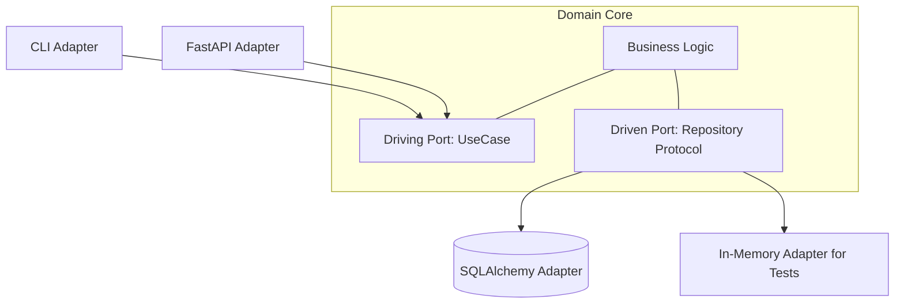
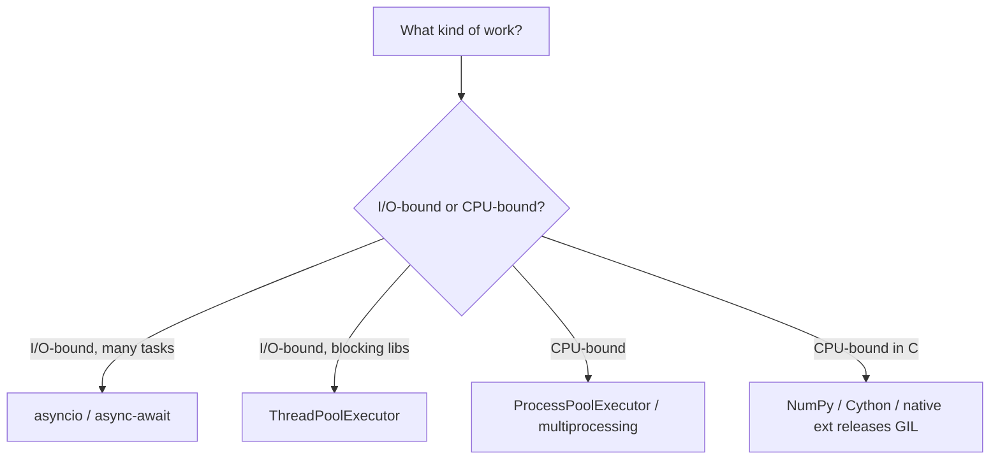

# Design Patterns in Python -- Comprehensive Reference

> A deep-dive, interview-focused reference covering software design patterns with idiomatic, modern Python (3.10+). Covers the design principles behind patterns, all 23 Gang of Four (GoF) patterns, Pythonic idioms that often replace classic patterns (first-class functions, decorators, Protocols, dataclasses, `functools`), and architectural and concurrency patterns. A recurring theme: Python's dynamic typing and first-class functions make many GoF patterns near-trivial or unnecessary. Each section includes intent, runnable code, the Pythonic alternative, trade-offs, and interview questions. Complements the *Python Fundamentals* and *CS Fundamentals* guides.

---

## Table of Contents

### Part 1: Foundations

1. [What Design Patterns Are (and Are Not)](#1-what-design-patterns-are-and-are-not)
2. [Design Principles: SOLID and Beyond](#2-design-principles-solid-and-beyond)
3. [Why Python Changes the Pattern Calculus](#3-why-python-changes-the-pattern-calculus)

### Part 2: Creational Patterns

4. [Singleton](#4-singleton)
5. [Factory Method](#5-factory-method)
6. [Abstract Factory](#6-abstract-factory)
7. [Builder](#7-builder)
8. [Prototype](#8-prototype)

### Part 3: Structural Patterns

9. [Adapter](#9-adapter)
10. [Bridge](#10-bridge)
11. [Composite](#11-composite)
12. [Decorator](#12-decorator)
13. [Facade](#13-facade)
14. [Flyweight](#14-flyweight)
15. [Proxy](#15-proxy)

### Part 4: Behavioral Patterns

16. [Chain of Responsibility](#16-chain-of-responsibility)
17. [Command](#17-command)
18. [Interpreter](#18-interpreter)
19. [Iterator](#19-iterator)
20. [Mediator](#20-mediator)
21. [Memento](#21-memento)
22. [Observer](#22-observer)
23. [State](#23-state)
24. [Strategy](#24-strategy)
25. [Template Method](#25-template-method)
26. [Visitor](#26-visitor)

### Part 5: Pythonic Idioms and Alternatives

27. [Duck Typing and Protocols](#27-duck-typing-and-protocols)
28. [Decorators (Function and Class)](#28-decorators-function-and-class)
29. [Context Managers](#29-context-managers)
30. [Descriptors and Properties](#30-descriptors-and-properties)
31. [Metaclasses](#31-metaclasses)
32. [functools: singledispatch, lru_cache, partial](#32-functools-singledispatch-lru_cache-partial)
33. [Dataclasses and First-Class Functions](#33-dataclasses-and-first-class-functions)

### Part 6: Architectural Patterns

34. [MVC, MVP, and MVVM](#34-mvc-mvp-and-mvvm)
35. [Layered and Hexagonal Architecture](#35-layered-and-hexagonal-architecture)
36. [Repository Pattern](#36-repository-pattern)
37. [Dependency Injection and IoC](#37-dependency-injection-and-ioc)
38. [Event-Driven and Publish-Subscribe](#38-event-driven-and-publish-subscribe)

### Part 7: Concurrency Patterns

39. [Producer-Consumer](#39-producer-consumer)
40. [Thread and Process Pools](#40-thread-and-process-pools)
41. [Future and Async/Await](#41-future-and-asyncawait)
42. [Actor Model](#42-actor-model)
43. [The GIL and Choosing a Concurrency Model](#43-the-gil-and-choosing-a-concurrency-model)

### Part 8: Quick Reference

44. [Pattern Cheat Sheet](#44-pattern-cheat-sheet)
45. [Anti-Patterns](#45-anti-patterns)
46. [Decision Guide](#46-decision-guide)

---

# Part 1: Foundations

---

# 1. What Design Patterns Are (and Are Not)

A **design pattern** is a named, reusable solution to a commonly recurring design problem in a particular context. Patterns describe *how to structure objects and their interactions*; they are not code you copy, libraries you import, or finished designs. They were popularized by the 1994 "Gang of Four" (GoF) book *Design Patterns: Elements of Reusable Object-Oriented Software*.

**What a pattern gives you:**

- A shared vocabulary ("use a Strategy here") that compresses design discussions.
- A proven structure with documented trade-offs.
- Guidance on which parts of a design should vary independently.

**What a pattern is *not*:**

- A goal in itself -- forcing patterns where they aren't needed ("patternitis") adds accidental complexity.
- Language-neutral. The GoF examples target 1990s C++/Smalltalk. In Python, first-class functions, dynamic typing, and rich built-ins make many patterns trivial, one-liners, or unnecessary. Peter Norvig famously observed that 16 of the 23 GoF patterns are "invisible or simpler" in dynamic languages.

| Term | Meaning |
|---|---|
| **Idiom** | A low-level, language-specific pattern (e.g. context managers, comprehensions in Python). |
| **Design pattern** | A mid-level solution to an object-interaction problem (GoF). |
| **Architectural pattern** | A high-level structure for an entire system (MVC, layered, hexagonal). |
| **Anti-pattern** | A common "solution" that causes more harm than good. |

**The key question** before reaching for a pattern: *"what is varying, and how do I isolate that variation?"* In Python, the answer is frequently "pass a function" rather than "build a class hierarchy".

---

# 2. Design Principles: SOLID and Beyond

Patterns are applications of deeper principles. Understanding the principles lets you derive patterns rather than memorize them.

## 2.1 SOLID

| Principle | Statement | Python application |
|---|---|---|
| **S** -- Single Responsibility | A class should have one reason to change. | Split modules/classes by concern; keep functions focused. |
| **O** -- Open/Closed | Open for extension, closed for modification. | Add behavior via new functions/subclasses or registration, not by editing `if/elif` chains; `functools.singledispatch`. |
| **L** -- Liskov Substitution | Subtypes must be usable through the base interface. | Honor the base class/Protocol contract; don't surprise callers with new exceptions or stricter inputs. |
| **I** -- Interface Segregation | Many small interfaces beat one fat one. | Small `Protocol`s / ABCs; rely on duck typing for narrow needs. |
| **D** -- Dependency Inversion | Depend on abstractions, not concretions. | Take a callable or a `Protocol`-typed dependency; inject it rather than importing a concrete class. |

## 2.2 Other key principles

- **Composition over inheritance.** Assemble behavior from collaborators and functions rather than deep class trees.
- **Program to an interface (Protocol), not an implementation.** In Python the "interface" is often just a duck-typed expectation or a `typing.Protocol`.
- **Encapsulate what varies.** Isolate the changing aspect behind a stable boundary (often a function parameter).
- **Law of Demeter.** Avoid long `a.b.c.d` chains; talk only to immediate collaborators.
- **DRY** and **YAGNI:** balance abstraction against speculative generality. Python's flexibility makes over-engineering especially easy and especially costly to read.
- **EAFP over LBYL:** "Easier to Ask Forgiveness than Permission" -- the Pythonic style of trying an operation and catching exceptions rather than pre-checking, which influences how patterns like Proxy and Chain are written.

```python
from typing import Protocol

class Logger(Protocol):              # structural interface -- no inheritance required
    def log(self, msg: str) -> None: ...

class OrderService:
    def __init__(self, logger: Logger) -> None:   # depend on the abstraction
        self._logger = logger
    def place(self) -> None:
        self._logger.log("order placed")
```

---

# 3. Why Python Changes the Pattern Calculus

Before each pattern, ask whether a Python feature already solves it. Recurring substitutions:

| GoF pattern | Pythonic replacement |
|---|---|
| Strategy | Pass a function (functions are first-class objects). |
| Command | A callable, `functools.partial`, or a closure. |
| Factory Method / Abstract Factory | A function returning objects; classes are first-class and callable. |
| Iterator | Generators and the iterator protocol (`__iter__`/`__next__`). |
| Template Method | Pass hook functions, or use ABCs with abstract methods. |
| Decorator (add behavior) | The `@decorator` syntax (function/class decorators). |
| Singleton | A module (modules are singletons), or a metaclass. |
| Visitor | `functools.singledispatch` (dispatch on type). |
| Adapter | Duck typing -- often no adapter class needed at all. |
| Prototype | `copy.copy` / `copy.deepcopy` built in. |
| Observer | A list of callbacks; or libraries (`blinker`). |

This does not make the patterns worthless -- knowing them clarifies *intent* and aids communication -- but idiomatic Python expresses most of them with far less ceremony than C++ or Java. The sections below show both the "classic" form (for recognition) and the Pythonic form (for real code).

# Part 2: Creational Patterns

---

# 4. Singleton

**Intent:** Ensure a class has exactly one instance with a global access point.

**The most Pythonic singleton is a module.** A module is imported once and cached in `sys.modules`; its top-level objects are effectively singletons with lazy, thread-safe initialization handled by the import system.

```python
# config.py  -- the module IS the singleton
_settings = {"debug": False}
def get(key): return _settings[key]
def set(key, value): _settings[key] = value
```

**Metaclass singleton** (when you truly need a single object of a class):

```python
class SingletonMeta(type):
    _instances: dict = {}
    def __call__(cls, *args, **kwargs):
        if cls not in cls._instances:
            cls._instances[cls] = super().__call__(*args, **kwargs)
        return cls._instances[cls]

class Database(metaclass=SingletonMeta):
    def __init__(self) -> None:
        self.connection = "connected"

a = Database()
b = Database()
assert a is b           # same instance
```

**Other approaches:** a decorator that caches the instance, or overriding `__new__`. For thread safety, guard creation with a `threading.Lock` (double-checked).

**Trade-offs:** Singletons are global state -- they hide dependencies and complicate testing (tests can't easily reset or substitute them). Prefer dependency injection and pass the shared object explicitly; reserve the singleton for the composition root.

---

# 5. Factory Method

**Intent:** Define an interface for creating an object but let subclasses (or a function) decide which class to instantiate.

**Pythonic form -- a function, since classes are first-class callables:**

```python
from typing import Protocol

class Button(Protocol):
    def render(self) -> None: ...

class WinButton: 
    def render(self) -> None: ...
class MacButton:
    def render(self) -> None: ...

def make_button(os: str) -> Button:        # simple factory function
    registry = {"win": WinButton, "mac": MacButton}
    return registry[os]()                   # classes are callable -> instantiate
```

**Registry pattern (Open/Closed):** new types register themselves without editing the factory:

```python
_REGISTRY: dict[str, type] = {}
def register(name):
    def deco(cls):
        _REGISTRY[name] = cls
        return cls
    return deco

@register("png")
class PngExporter: ...

def create_exporter(fmt: str):
    return _REGISTRY[fmt]()
```

**Classic OO form** (for recognition): a base class with an abstract `create_button()` overridden by subclasses, used inside a template method. Rarely needed in Python.

---

# 6. Abstract Factory

**Intent:** Create *families* of related objects without specifying concrete classes.

```python
from typing import Protocol

class Button(Protocol): ...
class Checkbox(Protocol): ...

class GuiFactory(Protocol):
    def create_button(self) -> Button: ...
    def create_checkbox(self) -> Checkbox: ...

class WinFactory:
    def create_button(self) -> Button: return WinButton()
    def create_checkbox(self) -> Checkbox: return WinCheckbox()

class MacFactory:
    def create_button(self) -> Button: return MacButton()
    def create_checkbox(self) -> Checkbox: return MacCheckbox()

def build_ui(factory: GuiFactory) -> None:   # client codes against the Protocol
    button = factory.create_button()
    checkbox = factory.create_checkbox()
```

A factory in Python can even be a simple object or module grouping the related constructors. **Factory Method vs Abstract Factory:** Factory Method makes one product (via inheritance); Abstract Factory makes a coordinated *family* (via a composed object). Adding a new product *kind* forces changing every factory.

---

# 7. Builder

**Intent:** Construct a complex object step by step; useful when there are many optional parameters.

**Python often needs no builder** thanks to keyword arguments with defaults and dataclasses:

```python
from dataclasses import dataclass, field

@dataclass
class HttpRequest:
    url: str
    method: str = "GET"
    headers: dict[str, str] = field(default_factory=dict)
    body: str = ""
    timeout_ms: int = 30000

req = HttpRequest("https://api.example.com", method="POST", timeout_ms=5000)
```

**Fluent builder** when construction has steps/validation or you want a chainable DSL:

```python
class QueryBuilder:
    def __init__(self) -> None:
        self._table = ""
        self._wheres: list[str] = []
        self._limit: int | None = None
    def table(self, t: str) -> "QueryBuilder":
        self._table = t; return self
    def where(self, cond: str) -> "QueryBuilder":
        self._wheres.append(cond); return self
    def limit(self, n: int) -> "QueryBuilder":
        self._limit = n; return self
    def build(self) -> str:
        sql = f"SELECT * FROM {self._table}"
        if self._wheres: sql += " WHERE " + " AND ".join(self._wheres)
        if self._limit is not None: sql += f" LIMIT {self._limit}"
        return sql

sql = QueryBuilder().table("users").where("age > 18").limit(10).build()
```

Each method returns `self` to enable chaining. Prefer keyword args/dataclasses unless you need staged construction or validation logic.

---

# 8. Prototype

**Intent:** Create new objects by copying an existing instance.

**Python has this built in** via the `copy` module -- no `clone()` method needed:

```python
import copy

class Sprite:
    def __init__(self, image, position, tags):
        self.image = image
        self.position = position
        self.tags = tags

original = Sprite("hero.png", [0, 0], ["player"])
shallow = copy.copy(original)        # new object, shared nested references
deep = copy.deepcopy(original)       # fully independent copy
```

**Shallow vs deep:** `copy.copy` copies the top object but shares nested mutable objects; `copy.deepcopy` recursively copies everything. Customize with `__copy__` and `__deepcopy__` if needed (e.g. to avoid copying a DB connection). A **prototype registry** maps keys to pre-configured instances you `deepcopy` on demand.

# Part 3: Structural Patterns

---

# 9. Adapter

**Intent:** Convert one interface into another that clients expect, so incompatible classes work together.

**Often unnecessary in Python** -- duck typing means an object only needs the right methods, not the right base class. When you genuinely must translate an API:

```python
class FahrenheitSensor:                 # adaptee with the "wrong" interface
    def get_fahrenheit(self) -> float:
        return 98.6

class CelsiusSensor:                     # target interface our code expects
    def get_celsius(self) -> float: ...

class FahrenheitToCelsiusAdapter:        # object adapter via composition
    def __init__(self, sensor: FahrenheitSensor) -> None:
        self._sensor = sensor
    def get_celsius(self) -> float:
        return (self._sensor.get_fahrenheit() - 32) * 5 / 9
```

A lighter adapter is sometimes just a function or a `functools.partial`. **Adapter vs Decorator vs Proxy:** Adapter *changes* an interface; Decorator *adds behavior* with the same interface; Proxy *controls access* with the same interface.

---

# 10. Bridge

**Intent:** Decouple an abstraction from its implementation so both vary independently, avoiding a combinatorial class explosion.

```python
from typing import Protocol

class DrawingAPI(Protocol):              # implementation side
    def draw_circle(self, x: float, y: float, r: float) -> None: ...

class RasterAPI:
    def draw_circle(self, x, y, r) -> None: ...   # pixel rendering
class VectorAPI:
    def draw_circle(self, x, y, r) -> None: ...   # svg rendering

class Shape:                              # abstraction holds an implementation
    def __init__(self, api: DrawingAPI) -> None:
        self._api = api
    def draw(self) -> None: ...

class Circle(Shape):
    def __init__(self, api: DrawingAPI, x, y, r) -> None:
        super().__init__(api)
        self.x, self.y, self.r = x, y, r
    def draw(self) -> None:
        self._api.draw_circle(self.x, self.y, self.r)   # delegate across the bridge
```

With N shapes and M renderers, Bridge needs N + M classes instead of N x M. **Bridge vs Strategy:** structurally similar (both delegate to an injected object), but Bridge is a design-time split of two whole hierarchies; Strategy is a runtime swap of one algorithm.

---

# 11. Composite

**Intent:** Compose objects into trees and treat individual objects and compositions uniformly.

```python
from typing import Protocol

class FsNode(Protocol):
    def size(self) -> int: ...

class File:                              # leaf
    def __init__(self, bytes_: int) -> None:
        self._bytes = bytes_
    def size(self) -> int:
        return self._bytes

class Directory:                          # composite
    def __init__(self) -> None:
        self._children: list[FsNode] = []
    def add(self, node: FsNode) -> None:
        self._children.append(node)
    def size(self) -> int:
        return sum(child.size() for child in self._children)   # recurse uniformly

root = Directory()
root.add(File(100))
sub = Directory(); sub.add(File(50)); root.add(sub)
print(root.size())   # 150
```

Both `File` and `Directory` satisfy `FsNode`, so client code treats them identically. Examples: DOM trees, GUI widget trees, expression ASTs, JSON-like nested structures.

---

# 12. Decorator

**Intent:** Attach additional responsibilities to an object dynamically -- a flexible alternative to subclassing.

**Python has two distinct things called "decorator":** the GoF object-wrapping pattern, and the `@` syntax (a language feature). The `@` decorator is the idiomatic way to add behavior to *functions/methods*:

```python
import functools, time

def timed(func):                          # function decorator
    @functools.wraps(func)                # preserve name/docstring/signature
    def wrapper(*args, **kwargs):
        start = time.perf_counter()
        result = func(*args, **kwargs)
        print(f"{func.__name__} took {time.perf_counter()-start:.4f}s")
        return result
    return wrapper

@timed
def crunch(n: int) -> int:
    return sum(range(n))
```

The **GoF object decorator** wraps an object to extend it, stacking at runtime:

```python
class DataSource(Protocol):
    def write(self, data: str) -> None: ...
    def read(self) -> str: ...

class FileSource: ...                      # concrete component

class CompressionDecorator:                # wraps another DataSource
    def __init__(self, wrapped: DataSource) -> None:
        self._wrapped = wrapped
    def write(self, data: str) -> None:
        self._wrapped.write(compress(data))
    def read(self) -> str:
        return decompress(self._wrapped.read())

source = CompressionDecorator(EncryptionDecorator(FileSource()))   # stack in any order
```

`@functools.wraps` is essential so the wrapper keeps the original metadata. Decorators that take arguments are decorator factories (a function returning a decorator).

---

# 13. Facade

**Intent:** Provide a simplified, unified interface to a complex subsystem.

```python
class VideoConverter:                      # facade over codecs, readers, mixers
    def convert(self, filename: str, fmt: str) -> "File":
        file = FileReader.read(filename)
        codec = CodecFactory.extract(file)
        result = BitrateReader.process(file, codec)
        return AudioMixer().fix(result, fmt)   # client never sees the internals

mp4 = VideoConverter().convert("clip.ogg", "mp4")
```

A facade is often just a function or a module that wraps a sequence of lower-level calls. **Facade vs Adapter:** Adapter makes an existing interface match an expected one; Facade defines a *new, simpler* interface over many classes. The facade doesn't forbid direct subsystem access -- it's a convenience layer.

---

# 14. Flyweight

**Intent:** Share many fine-grained objects efficiently by separating shared (intrinsic) state from per-use (extrinsic) state.

```python
import sys

class Glyph:                               # intrinsic, shared, immutable
    __slots__ = ("char", "font")           # __slots__ shrinks per-instance memory
    def __init__(self, char: str, font: str) -> None:
        self.char = char
        self.font = font

class GlyphFactory:
    def __init__(self) -> None:
        self._pool: dict[tuple[str, str], Glyph] = {}
    def get(self, char: str, font: str) -> Glyph:
        key = (char, font)
        if key not in self._pool:
            self._pool[key] = Glyph(char, font)    # create once, reuse forever
        return self._pool[key]
```

**Python built-ins already do this:** small integers (-5..256) and short interned strings are cached/shared by CPython (`a = 256; b = 256; a is b` is `True`). Use `__slots__` to cut memory for many small objects, and a pool/cache (`functools.lru_cache`) to share immutable flyweights.

---

# 15. Proxy

**Intent:** Provide a surrogate for another object to control access to it.

| Variant | Purpose |
|---|---|
| **Virtual proxy** | Lazy creation/loading of an expensive object |
| **Protection proxy** | Permission checks before delegating |
| **Remote proxy** | Local stand-in for a remote object (RPC) |
| **Caching proxy** | Memoize expensive results |

```python
class ExpensiveImage:
    def __init__(self, path: str) -> None:
        self._path = path
        self._load()                        # heavy work
    def display(self) -> None: ...

class LazyImageProxy:                        # virtual proxy
    def __init__(self, path: str) -> None:
        self._path = path
        self._real: ExpensiveImage | None = None
    def display(self) -> None:
        if self._real is None:
            self._real = ExpensiveImage(self._path)   # create on first use
        self._real.display()
```

`__getattr__` makes transparent proxies easy -- forward any unknown attribute to the wrapped object:

```python
class LoggingProxy:
    def __init__(self, target) -> None:
        object.__setattr__(self, "_target", target)
    def __getattr__(self, name):
        print(f"accessing {name}")
        return getattr(self._target, name)   # delegate everything else
```

**Proxy vs Decorator:** both wrap and keep the interface, but Proxy *controls access/lifetime* (often creating the subject itself) while Decorator *adds behavior* to an object handed to it.

# Part 4: Behavioral Patterns

---

# 16. Chain of Responsibility

**Intent:** Pass a request along a chain of handlers; each handles it or forwards it. Decouples sender from receiver.

```python
from typing import Callable, Optional

Handler = Callable[[dict], Optional[str]]   # returns a result, or None to pass on

def make_chain(*handlers: Handler) -> Handler:
    def run(request: dict) -> Optional[str]:
        for handler in handlers:
            result = handler(request)
            if result is not None:           # handled -> stop
                return result
        return None
    return run

def auth(req):  return "401" if not req.get("user") else None
def validate(req): return "400" if not req.get("body") else None
def process(req): return "200 OK"

pipeline = make_chain(auth, validate, process)
print(pipeline({"user": "ann", "body": "x"}))   # 200 OK
```

The classic OO form links handler objects via a `next` reference, but a list of functions is the Pythonic expression. Used for middleware (WSGI/ASGI), event bubbling, and validation pipelines.

---

# 17. Command

**Intent:** Encapsulate a request as an object to parameterize, queue, log, or undo it.

**A callable is a command in Python.** Use closures or `functools.partial` for fire-and-forget commands:

```python
import functools

def insert_text(doc, text, pos): ...
command = functools.partial(insert_text, doc, "hello", 0)   # a deferred call
command()                                                    # execute later
```

**Full command with undo** (when you need reversibility) -- use callables or a small protocol:

```python
from dataclasses import dataclass

@dataclass
class InsertCommand:
    doc: list
    text: str
    pos: int
    def execute(self) -> None: self.doc.insert(self.pos, self.text)
    def undo(self) -> None:    del self.doc[self.pos]

class History:
    def __init__(self) -> None:
        self._done: list = []
    def run(self, cmd) -> None:
        cmd.execute(); self._done.append(cmd)
    def undo(self) -> None:
        if self._done: self._done.pop().undo()
```

Queue commands as `list[Callable]`, or for undo/redo/serialization use the object form. The `__call__` dunder lets a command object also behave like a plain function.

---

# 18. Interpreter

**Intent:** Define a representation for a grammar plus an interpreter to evaluate sentences of the language.

```python
from dataclasses import dataclass
from typing import Union

@dataclass
class Num:
    value: int
    def eval(self) -> int: return self.value

@dataclass
class Add:
    left: "Expr"
    right: "Expr"
    def eval(self) -> int: return self.left.eval() + self.right.eval()

Expr = Union[Num, Add]

tree = Add(Num(3), Add(Num(4), Num(5)))
print(tree.eval())   # 12
```

The AST is a Composite; the Interpreter adds `eval`. For real languages use `ast`, `lark`, or `pyparsing` rather than hand-rolling. Best reserved for small, stable DSLs (filter rules, calculators).

---

# 19. Iterator

**Intent:** Access elements of a collection sequentially without exposing its internals.

**Python builds this in** via the iterator protocol (`__iter__`/`__next__`) and especially **generators**:

```python
class Fibonacci:
    def __init__(self, n: int) -> None:
        self._n = n
    def __iter__(self):                      # generator-based iterator
        a, b = 0, 1
        for _ in range(self._n):
            yield a
            a, b = b, a + b

for x in Fibonacci(8):
    print(x)                                  # 0 1 1 2 3 5 8 13
```

A generator function returns an iterator automatically; `yield` suspends/resumes state. This is the canonical Iterator in Python -- you almost never implement `__next__` by hand. Generators are also lazy (compute on demand) and composable (`itertools`).

---

# 20. Mediator

**Intent:** Centralize complex many-to-many interactions in one object so components don't reference each other directly.

```python
class ChatRoom:                              # mediator
    def __init__(self) -> None:
        self._users: list["User"] = []
    def register(self, user: "User") -> None:
        self._users.append(user); user.room = self
    def broadcast(self, msg: str, sender: "User") -> None:
        for user in self._users:
            if user is not sender:
                user.receive(msg)            # central routing

class User:
    def __init__(self, name: str) -> None:
        self.name = name; self.room: ChatRoom | None = None
    def send(self, msg: str) -> None:
        self.room.broadcast(msg, self)
    def receive(self, msg: str) -> None: ...
```

**Mediator vs Observer:** Observer is generic one-to-many notification; Mediator encapsulates *specific bidirectional* coordination logic. Keep the mediator focused or it becomes a God object.

---

# 21. Memento

**Intent:** Capture and restore an object's internal state without breaking encapsulation.

```python
import copy

class Editor:
    def __init__(self) -> None:
        self._text = ""
    def type(self, s: str) -> None:
        self._text += s
    def save(self) -> dict:                   # produce an opaque snapshot
        return copy.deepcopy(self.__dict__)
    def restore(self, memento: dict) -> None:
        self.__dict__.update(memento)

editor = Editor()
editor.type("hello")
snapshot = editor.save()
editor.type(" world")
editor.restore(snapshot)                       # back to "hello"
```

Roles: *Originator* (Editor) creates/uses mementos; *Caretaker* (a history stack) stores them without inspecting them. Snapshots can be a `dataclass`, a dict, or a `copy.deepcopy` of state. Combine with Command for undo/redo.

---

# 22. Observer

**Intent:** One-to-many dependency: when the subject changes, all observers are notified.

**A list of callbacks is the Pythonic Observer:**

```python
from typing import Callable

class Observable:
    def __init__(self) -> None:
        self._observers: list[Callable[[int], None]] = []
    def subscribe(self, callback: Callable[[int], None]) -> Callable[[], None]:
        self._observers.append(callback)
        return lambda: self._observers.remove(callback)   # return an unsubscribe handle
    def notify(self, value: int) -> None:
        for cb in list(self._observers):                  # iterate a copy (re-entrancy safe)
            cb(value)

stock = Observable()
unsubscribe = stock.subscribe(lambda price: print(f"price={price}"))
stock.notify(100)
unsubscribe()
```

**Pitfalls:** iterate over a *copy* of the observer list so callbacks can subscribe/unsubscribe during notification; beware holding strong references that prevent garbage collection (use `weakref` for long-lived subjects). Libraries: `blinker`, Qt signals, RxPY for reactive streams.

---

# 23. State

**Intent:** Let an object change behavior when its internal state changes, replacing large `if/elif` state machines with polymorphism.

```python
from typing import Protocol

class State(Protocol):
    def publish(self, doc: "Document") -> None: ...

class Draft:
    def publish(self, doc): doc.state = Moderation()
class Moderation:
    def publish(self, doc): doc.state = Published()
class Published:
    def publish(self, doc): pass               # already published

class Document:
    def __init__(self) -> None:
        self.state: State = Draft()
    def publish(self) -> None:
        self.state.publish(self)               # delegate to current state

doc = Document()
doc.publish()   # Draft -> Moderation
doc.publish()   # Moderation -> Published
```

For simple machines, an `enum` plus a transition table (dict) is often clearer; libraries like `transitions` handle complex FSMs. **State vs Strategy:** identical structure, but State objects drive their own transitions and know about each other, whereas Strategy algorithms are independent and chosen by the client.

---

# 24. Strategy

**Intent:** Define interchangeable algorithms and swap them at runtime.

**Pass a function -- this is the canonical example of "functions replace patterns" in Python:**

```python
from typing import Callable

def quicksort(data): return sorted(data)
def reverse_sort(data): return sorted(data, reverse=True)

class Sorter:
    def __init__(self, strategy: Callable[[list], list]) -> None:
        self._strategy = strategy
    def run(self, data: list) -> list:
        return self._strategy(data)

Sorter(reverse_sort).run([3, 1, 2])           # [3, 2, 1]
```

The built-in `sorted(data, key=...)` already takes a strategy (the `key` function). Use the class-based form only when strategies carry significant state or must be enumerated/serialized. `functools.partial` parameterizes a strategy without writing a class.

---

# 25. Template Method

**Intent:** Define an algorithm skeleton, deferring specific steps to subclasses.

```python
from abc import ABC, abstractmethod

class DataMiner(ABC):
    def mine(self, path: str) -> None:        # template method: fixed skeleton
        raw = self._open(path)
        data = self._extract(raw)             # varies by subclass
        self._report(self._analyze(data))     # common steps

    @abstractmethod
    def _extract(self, raw: str) -> list: ... # hook

    def _open(self, path): ...                 # shared
    def _analyze(self, data): ...              # shared
    def _report(self, analysis): ...           # shared

class CsvMiner(DataMiner):
    def _extract(self, raw): return raw.split(",")
```

**Hollywood Principle** -- "don't call us, we'll call you": the base controls flow and calls down into hooks. The Pythonic alternative is to pass the varying step as a *function* argument (composition over inheritance), turning Template Method into Strategy.

---

# 26. Visitor

**Intent:** Add new operations over a fixed set of element types without modifying those types.

**`functools.singledispatch` is the Pythonic Visitor** -- it dispatches on the type of the first argument:

```python
from functools import singledispatch
from dataclasses import dataclass

@dataclass
class Circle: radius: float
@dataclass
class Square: side: float

@singledispatch
def area(shape) -> float:
    raise NotImplementedError(f"no area for {type(shape)}")

@area.register
def _(shape: Circle) -> float:
    return 3.14159 * shape.radius ** 2

@area.register
def _(shape: Square) -> float:
    return shape.side ** 2

print(area(Circle(2)))   # 12.566...
```

This adds a new *operation* (`area`, then `perimeter`, ...) without touching the shape classes -- exactly Visitor's intent -- and avoids the verbose `accept`/`visit` double-dispatch boilerplate. **Trade-off:** like Visitor, easy to add operations but adding a new *type* means updating each dispatched function. The classic `accept(visitor)` form still appears in AST libraries (`ast.NodeVisitor`).

# Part 5: Pythonic Idioms and Alternatives

These are Python-specific patterns -- language features and idioms that frequently replace classic GoF patterns or express them with far less code.

---

# 27. Duck Typing and Protocols

**Duck typing:** "If it walks like a duck and quacks like a duck, it's a duck." Python cares about whether an object *has the required methods*, not its class. This eliminates the need for many Adapter and interface declarations.

```python
def render_all(items):                 # works with ANY object that has .render()
    for item in items:
        item.render()                  # no common base class required
```

**Protocols (PEP 544, structural subtyping):** `typing.Protocol` gives you static type checking for duck typing -- a class satisfies a Protocol just by having the right methods, with no explicit inheritance:

```python
from typing import Protocol, runtime_checkable

@runtime_checkable
class Drawable(Protocol):
    def draw(self) -> None: ...

class Circle:
    def draw(self) -> None: ...        # satisfies Drawable without inheriting it

def paint(d: Drawable) -> None:        # type checker enforces the structural contract
    d.draw()

paint(Circle())                         # OK
isinstance(Circle(), Drawable)          # True (with @runtime_checkable)
```

**ABCs vs Protocols:** Abstract Base Classes (`abc.ABC`) use *nominal* subtyping (you must inherit and they can enforce method implementation at instantiation); Protocols use *structural* subtyping (no inheritance, ideal for duck typing and third-party types you can't modify). Prefer Protocols for interfaces, ABCs when you want shared implementation or runtime enforcement.

---

# 28. Decorators (Function and Class)

A **decorator** is a callable that takes a function/class and returns a replacement -- the language's built-in tool for adding cross-cutting behavior (the Decorator pattern, AOP-style).

```python
import functools

def retry(times: int):                  # decorator factory (takes arguments)
    def decorator(func):
        @functools.wraps(func)
        def wrapper(*args, **kwargs):
            for attempt in range(times):
                try:
                    return func(*args, **kwargs)
                except Exception:
                    if attempt == times - 1:
                        raise
        return wrapper
    return decorator

@retry(times=3)
def fetch(url): ...
```

**Class decorators** modify or wrap classes (`@dataclass`, `@functools.total_ordering`):

```python
@functools.total_ordering             # generates <=, >, >= from __eq__ and __lt__
class Version:
    def __init__(self, major, minor):
        self.major, self.minor = major, minor
    def __eq__(self, o): return (self.major, self.minor) == (o.major, o.minor)
    def __lt__(self, o): return (self.major, self.minor) < (o.major, o.minor)
```

Always use `@functools.wraps` to preserve the wrapped object's metadata. Decorators stack bottom-up. Common uses: caching, logging, timing, access control, registration, validation.

---

# 29. Context Managers

**Intent:** Guarantee setup/teardown around a block -- Python's equivalent of C++ RAII. Implemented via `__enter__`/`__exit__` or the `@contextmanager` generator decorator.

```python
from contextlib import contextmanager

class FileResource:                    # class-based context manager
    def __init__(self, path: str) -> None:
        self._path = path
    def __enter__(self):
        self._f = open(self._path)
        return self._f
    def __exit__(self, exc_type, exc_val, tb):
        self._f.close()               # runs even if the block raises
        return False                   # don't suppress exceptions

@contextmanager
def timer(label: str):                 # generator-based context manager
    import time
    start = time.perf_counter()
    try:
        yield                          # the "with" body runs here
    finally:
        print(f"{label}: {time.perf_counter()-start:.4f}s")

with timer("work"):
    do_stuff()
```

`__exit__` runs on normal exit *and* on exceptions, making cleanup deterministic. `contextlib` offers `suppress`, `closing`, `ExitStack` (manage a dynamic number of contexts), and async context managers (`__aenter__`/`__aexit__`).

---

# 30. Descriptors and Properties

**Descriptors** are objects defining `__get__`/`__set__`/`__delete__` that control attribute access -- the mechanism behind `property`, `classmethod`, `staticmethod`, and ORM fields. They underpin reusable, type-safe attribute behavior.

```python
class Positive:                         # reusable validating descriptor
    def __set_name__(self, owner, name):
        self._name = f"_{name}"
    def __get__(self, obj, objtype=None):
        return getattr(obj, self._name)
    def __set__(self, obj, value):
        if value <= 0:
            raise ValueError("must be positive")
        setattr(obj, self._name, value)

class Account:
    balance = Positive()                # validation reused declaratively
    def __init__(self, balance):
        self.balance = balance
```

**`property`** is the common, simpler case -- computed/validated attributes without a separate class:

```python
class Circle:
    def __init__(self, r): self._r = r
    @property
    def area(self) -> float:            # accessed like an attribute: c.area
        return 3.14159 * self._r ** 2
    @property
    def radius(self) -> float: return self._r
    @radius.setter
    def radius(self, value) -> None:
        if value < 0: raise ValueError
        self._r = value
```

Use `property` for one-off computed attributes; write a descriptor when the same access logic is reused across many attributes/classes.

---

# 31. Metaclasses

**Intent:** Control how *classes themselves* are created (a class is an instance of its metaclass, which defaults to `type`). The deepest customization hook -- "metaclasses are deeper magic than 99% of users should ever worry about" (Tim Peters).

```python
class RegistryMeta(type):
    registry: dict = {}
    def __new__(mcs, name, bases, namespace):
        cls = super().__new__(mcs, name, bases, namespace)
        if bases:                       # skip the base class itself
            RegistryMeta.registry[name] = cls   # auto-register every subclass
        return cls

class Plugin(metaclass=RegistryMeta):
    pass

class PdfPlugin(Plugin): pass           # automatically registered
print(RegistryMeta.registry)           # {'PdfPlugin': <class ...>}
```

**Use cases:** singletons (Section 4), auto-registration, enforcing class invariants, ORMs/serializers that build fields from class attributes. **Prefer simpler tools first:** `__init_subclass__` (customize subclass creation) and `__set_name__` (descriptor naming) handle most cases that historically needed metaclasses, with far less complexity. Class decorators are another lighter alternative.

---

# 32. functools: singledispatch, lru_cache, partial

The `functools` module provides several pattern-replacing tools:

```python
from functools import singledispatch, lru_cache, partial, reduce

# singledispatch -> Visitor / type-based dispatch (Section 26)
@singledispatch
def serialize(obj): raise NotImplementedError
@serialize.register
def _(obj: int): return str(obj)
@serialize.register
def _(obj: list): return "[" + ",".join(serialize(x) for x in obj) + "]"

# lru_cache -> memoization / Flyweight-style caching / virtual proxy
@lru_cache(maxsize=128)
def fib(n: int) -> int:
    return n if n < 2 else fib(n-1) + fib(n-2)

# partial -> pre-bound Command / Strategy
def log(level, msg): print(f"[{level}] {msg}")
error = partial(log, "ERROR")           # a specialized callable
error("disk full")                       # [ERROR] disk full
```

| Tool | Replaces / enables |
|---|---|
| `singledispatch` | Visitor, type-based polymorphism |
| `lru_cache` / `cache` | Memoization, caching proxy, flyweight |
| `partial` | Command, parameterized Strategy, currying |
| `reduce` | Fold/accumulate behavioral logic |
| `wraps` | Correct decorators |
| `total_ordering` | Generate comparison operators |
| `cached_property` | Lazy computed attribute (virtual proxy on an attribute) |

---

# 33. Dataclasses and First-Class Functions

**Dataclasses** (PEP 557) auto-generate `__init__`, `__repr__`, `__eq__`, and ordering, eliminating boilerplate for data-holding classes and replacing many Builder/value-object uses:

```python
from dataclasses import dataclass, field

@dataclass(frozen=True, order=True)     # frozen -> immutable & hashable; order -> comparisons
class Point:
    x: float
    y: float
    tags: list[str] = field(default_factory=list)   # mutable default done safely

p = Point(1.0, 2.0)
# p.x = 5  # raises -- frozen dataclass is immutable (good for value objects / flyweights)
```

**First-class functions** are the single biggest reason Python needs fewer patterns -- functions can be passed, returned, stored, and composed:

```python
# Functions as Strategy, stored in a dispatch table (replaces a switch/Factory):
operations = {
    "add": lambda a, b: a + b,
    "sub": lambda a, b: a - b,
    "mul": lambda a, b: a * b,
}
result = operations["add"](2, 3)        # 5

# Closures capture state (replace small Command/State objects):
def make_counter(start=0):
    count = start
    def increment():
        nonlocal count
        count += 1
        return count
    return increment

c = make_counter()
c(); c()                                  # 1, 2
```

When you find yourself writing a class with a single method, ask whether a function or closure would be clearer. When you write a class that's all data, reach for `@dataclass` (or `NamedTuple` / `attrs` / Pydantic for validation).

# Part 6: Architectural Patterns

Architectural patterns organize an entire application. They build on the GoF patterns (Observer, Strategy, Facade) at a larger scale.

---

# 34. MVC, MVP, and MVVM

These separate **domain/data**, **UI**, and the **glue** so each can change and be tested independently.

| Pattern | Parts | Who updates the view | Typical use |
|---|---|---|---|
| **MVC** | Model, View, Controller | View observes Model; Controller handles input | Django (MTV variant), Flask apps |
| **MVP** | Model, View, Presenter | Presenter pushes data to a passive View | Desktop/test-heavy UIs |
| **MVVM** | Model, View, ViewModel | Data binding syncs View <-> ViewModel | Declarative UIs |

```python
class Model:                            # domain data + observer subject
    def __init__(self) -> None:
        self._value = 0
        self._observers: list = []
    def subscribe(self, cb): self._observers.append(cb)
    def set(self, v: int) -> None:
        self._value = v
        for cb in self._observers: cb(v)

class View:
    def __init__(self, model: Model) -> None:
        model.subscribe(self.render)
    def render(self, value: int) -> None:
        print(f"value is {value}")

class Controller:                        # translates input into model changes
    def __init__(self, model: Model) -> None:
        self._model = model
    def on_input(self, value: int) -> None:
        self._model.set(value)
```

Note Django calls its variant **MTV** (Model-Template-View): the "view" is the controller-like function and the "template" is the presentation. The key win is that the Model has no UI dependency and is unit-testable on its own.

---

# 35. Layered and Hexagonal Architecture

**Layered (n-tier):** Presentation -> Application/Service -> Domain -> Infrastructure. Each layer depends only on the one below. Simple and common; risks leaking infrastructure concerns upward.

**Hexagonal (Ports and Adapters):** the domain sits at the center and defines **ports** (interfaces, in Python usually `Protocol`s or ABCs); the outside world plugs in via **adapters**. All dependencies point *inward*, so the domain knows nothing about web frameworks or databases.



```python
from typing import Protocol

class UserRepository(Protocol):          # port -- defined by the domain
    def find(self, user_id: int) -> "User | None": ...
    def save(self, user: "User") -> None: ...

class RegisterUser:                       # use case depends only on the port
    def __init__(self, repo: UserRepository) -> None:
        self._repo = repo
    def execute(self, user: "User") -> None:
        self._repo.save(user)

class SqlUserRepository:      ...          # adapter: real DB
class InMemoryUserRepository:             # adapter: fake for tests
    def __init__(self): self._data: dict = {}
    def find(self, user_id): return self._data.get(user_id)
    def save(self, user): self._data[user.id] = user
```

The core is testable with the in-memory adapter, and technology choices stay swappable and deferrable.

---

# 36. Repository Pattern

**Intent:** Provide a collection-like interface for accessing domain objects, hiding persistence (SQL, ORM, file, API) behind it.

```python
from typing import Protocol

class ProductRepository(Protocol):
    def get(self, product_id: int) -> "Product | None": ...
    def find_by_category(self, category: str) -> list["Product"]: ...
    def add(self, product: "Product") -> None: ...
    def remove(self, product_id: int) -> None: ...
```

**Benefits:** domain code calls `repo.get(id)` and never sees SQL; storage is swappable; caching can be added transparently (a decorator/proxy over the repository); tests use an in-memory implementation. **Pitfall:** leaking query details (raw SQL, ORM querysets) through the interface defeats the abstraction -- use typed query methods or a Specification object. Often paired with **Unit of Work** to manage transactions.

---

# 37. Dependency Injection and IoC

**Inversion of Control:** a class does not create its own dependencies; they are supplied from outside. **Dependency Injection** passes collaborators in -- the key enabler of testability and the practical form of the Dependency Inversion principle.

```python
# Without DI -- hard-wired, hard to test:
class ReportService_Bad:
    def __init__(self) -> None:
        self._db = SqlDatabase()          # created internally -> can't substitute

# With constructor injection -- depend on an abstraction passed in:
from typing import Protocol
class Database(Protocol):
    def query(self, sql: str) -> list: ...

class ReportService:
    def __init__(self, db: Database) -> None:
        self._db = db                      # injected; pass a real DB or a fake in tests
    def build(self) -> "Report":
        return Report(self._db.query("SELECT ..."))
```

| Form | How | Notes |
|---|---|---|
| Constructor injection | Pass via `__init__` | Preferred -- explicit, object always valid |
| Setter/attribute injection | Assign later | For optional dependencies |
| Parameter injection | Pass per call | When the dependency varies per operation |

**Composition root:** wire dependencies in one place (e.g. `main` or an app factory). Python's dynamic nature makes manual DI easy; frameworks like FastAPI provide built-in DI (`Depends`), and libraries like `dependency-injector` or `punq` offer containers when wiring grows large.

---

# 38. Event-Driven and Publish-Subscribe

**Intent:** Components communicate by emitting/reacting to events rather than calling each other directly. Pub/Sub generalizes Observer with a broker that routes messages by topic, so publishers and subscribers never reference each other.

```python
from collections import defaultdict
from typing import Callable

class EventBus:
    def __init__(self) -> None:
        self._subscribers: dict[str, list[Callable]] = defaultdict(list)
    def subscribe(self, event_type: str, handler: Callable) -> None:
        self._subscribers[event_type].append(handler)
    def publish(self, event_type: str, payload) -> None:
        for handler in self._subscribers[event_type]:
            handler(payload)               # broker routes to subscribers

bus = EventBus()
bus.subscribe("order_placed", lambda o: print(f"email for order {o}"))
bus.subscribe("order_placed", lambda o: print(f"update inventory for {o}"))
bus.publish("order_placed", 42)
```

**Observer vs Pub/Sub:** Observer is direct (the subject holds its observers); Pub/Sub adds a broker, fully decoupling the two sides and allowing cross-process messaging (Redis pub/sub, Kafka, RabbitMQ). **Trade-offs:** excellent decoupling and extensibility, but control flow is harder to trace; ordering, delivery guarantees, and error handling need explicit design.

# Part 7: Concurrency Patterns

Python concurrency is shaped by the **GIL** (Global Interpreter Lock). Choose the model by workload: threads/asyncio for I/O-bound, multiprocessing (or C extensions) for CPU-bound. Building blocks: `threading`, `queue`, `concurrent.futures`, `multiprocessing`, and `asyncio`.

---

# 39. Producer-Consumer

**Intent:** Decouple work production from consumption via a thread-safe queue, balancing throughput between producers and consumers.

```python
import threading, queue

q: queue.Queue = queue.Queue(maxsize=10)   # thread-safe, bounded (backpressure)
_SENTINEL = object()

def producer():
    for i in range(100):
        q.put(i)                            # blocks if full
    q.put(_SENTINEL)

def consumer():
    while True:
        item = q.get()                      # blocks if empty
        if item is _SENTINEL:
            q.put(_SENTINEL)                # let other consumers stop too
            break
        process(item)
        q.task_done()

threads = [threading.Thread(target=consumer) for _ in range(4)]
for t in threads: t.start()
producer()
for t in threads: t.join()
```

`queue.Queue` handles all locking internally -- never hand-roll a lock around a list when `queue` exists. A sentinel signals shutdown. `q.join()` + `task_done()` lets the producer wait for all work to finish. For async code use `asyncio.Queue`.

---

# 40. Thread and Process Pools

**Intent:** Reuse a pool of workers to run many tasks. `concurrent.futures` gives one API for both threads and processes.

```python
from concurrent.futures import ThreadPoolExecutor, ProcessPoolExecutor, as_completed

# I/O-bound -> threads (GIL released during I/O):
with ThreadPoolExecutor(max_workers=8) as pool:
    futures = [pool.submit(fetch_url, url) for url in urls]
    for fut in as_completed(futures):
        print(fut.result())                 # result or re-raised exception

# CPU-bound -> processes (sidestep the GIL with separate interpreters):
with ProcessPoolExecutor() as pool:
    results = list(pool.map(heavy_compute, range(100)))
```

| Executor | Best for | Why |
|---|---|---|
| `ThreadPoolExecutor` | I/O-bound (network, disk) | GIL is released during blocking I/O |
| `ProcessPoolExecutor` | CPU-bound | True parallelism across processes |

`submit` returns a `Future`; `as_completed` yields them as they finish; `map` preserves input order. Use the `with` block so the pool shuts down cleanly. Note process pools require picklable arguments and have IPC overhead.

---

# 41. Future and Async/Await

**Intent:** Represent a value available later. `asyncio` provides cooperative single-threaded concurrency ideal for high-concurrency I/O, using `async`/`await`.

```python
import asyncio

async def fetch(url: str) -> str:
    await asyncio.sleep(1)                  # non-blocking I/O placeholder
    return f"data from {url}"

async def main() -> None:
    # gather runs coroutines concurrently and awaits all results
    results = await asyncio.gather(
        fetch("a"), fetch("b"), fetch("c"),
    )
    print(results)

asyncio.run(main())                          # 3 fetches finish in ~1s, not 3s
```

**Key concepts:** a coroutine is created by calling an `async def`; `await` yields control back to the event loop while waiting; `asyncio.gather`/`asyncio.TaskGroup` (3.11+) run many coroutines concurrently. Futures (`concurrent.futures.Future`, `asyncio.Future`) are the underlying "value-to-come" objects. **Pitfalls:** never call blocking code inside a coroutine (it stalls the whole loop -- use `run_in_executor` or async libraries); don't mix `asyncio` and threads carelessly.

---

# 42. Actor Model

**Intent:** Independent actors own private state and communicate only via asynchronous messages -- no shared mutable state, hence no locks or data races.

```python
import threading, queue

class Actor(threading.Thread):
    def __init__(self) -> None:
        super().__init__(daemon=True)
        self._mailbox: queue.Queue = queue.Queue()
        self._running = True
    def send(self, message) -> None:
        self._mailbox.put(message)          # async, non-blocking
    def run(self) -> None:
        while self._running:
            message = self._mailbox.get()    # one message at a time
            self.on_message(message)
    def on_message(self, message) -> None:
        raise NotImplementedError

class Counter(Actor):
    def __init__(self) -> None:
        super().__init__()
        self._count = 0                      # private state -- no locking needed
    def on_message(self, message) -> None:
        if message == "inc":
            self._count += 1
```

Each actor processes messages sequentially on its own thread, so its state needs no synchronization. **Trade-offs:** eliminates data races and scales across cores/machines, but adds message-ordering, backpressure, and supervision concerns. Mature implementations: `pykka`, `thespian`, `ray`, and the Erlang/Akka ecosystems.

---

# 43. The GIL and Choosing a Concurrency Model

The **Global Interpreter Lock** allows only one thread to execute Python bytecode at a time in CPython, so threads do **not** give parallel speedup for CPU-bound pure-Python code. This single fact drives concurrency design in Python.



| Model | Parallelism | Best for | Notes |
|---|---|---|---|
| `threading` | No (GIL) for CPU; yes for I/O | I/O-bound with blocking APIs | Simple; GIL released during I/O and many C calls |
| `asyncio` | No (single thread) | Massive I/O concurrency | Needs async-aware libraries; very low overhead |
| `multiprocessing` | Yes (separate processes) | CPU-bound | IPC/pickling overhead; true parallelism |
| C extensions | Yes (release GIL) | Numeric/CPU work | NumPy, Cython, native code can release the GIL |

**Looking ahead:** Python 3.13 introduces an experimental free-threaded (no-GIL) build and a per-interpreter GIL (`PEP 684`), which will gradually change these trade-offs. Until then: I/O-bound -> `asyncio` or threads; CPU-bound -> processes or native extensions.

# Part 8: Quick Reference

---

# 44. Pattern Cheat Sheet

| Pattern | Category | Intent (one line) | Pythonic note |
|---|---|---|---|
| Singleton | Creational | One instance, global access | Use a module; or a metaclass |
| Factory Method | Creational | Defer which class to create | A function returning objects |
| Abstract Factory | Creational | Create families of products | Object/module of constructors |
| Builder | Creational | Step-by-step construction | Often just kwargs + dataclass |
| Prototype | Creational | Clone existing objects | `copy.copy` / `copy.deepcopy` |
| Adapter | Structural | Make interfaces compatible | Duck typing; often unneeded |
| Bridge | Structural | Separate abstraction/impl | Inject the implementation |
| Composite | Structural | Tree treated uniformly | `list` of nodes + recursion |
| Decorator | Structural | Add behavior dynamically | `@decorator` syntax |
| Facade | Structural | Simplify a subsystem | A wrapper function/module |
| Flyweight | Structural | Share many small objects | `__slots__`, `lru_cache`, interning |
| Proxy | Structural | Control access | `__getattr__`, `cached_property` |
| Chain of Responsibility | Behavioral | Pass request along handlers | List of functions |
| Command | Behavioral | Request as object; undo | Callable / `functools.partial` |
| Interpreter | Behavioral | Evaluate a grammar | AST classes + `eval`; use `ast` |
| Iterator | Behavioral | Sequential access | Generators / `yield` |
| Mediator | Behavioral | Centralize interactions | Hub object |
| Memento | Behavioral | Capture/restore state | `copy.deepcopy` of state |
| Observer | Behavioral | Notify many on change | List of callbacks |
| State | Behavioral | Behavior changes with state | State objects or enum + dict |
| Strategy | Behavioral | Interchangeable algorithms | Pass a function |
| Template Method | Behavioral | Skeleton with varying steps | ABC, or pass hook functions |
| Visitor | Behavioral | New ops over fixed types | `functools.singledispatch` |

| Pythonic idiom | Purpose |
|---|---|
| Duck typing / `Protocol` | Structural interfaces without inheritance |
| Function/class decorators | Cross-cutting behavior (the `@` syntax) |
| Context managers | Deterministic setup/teardown (RAII-like) |
| Descriptors / `property` | Reusable attribute access logic |
| Metaclasses / `__init_subclass__` | Customize class creation |
| `functools` | Dispatch, caching, partial application |
| Dataclasses | Boilerplate-free data/value objects |
| Generators | Lazy iteration and pipelines |

---

# 45. Anti-Patterns

| Anti-pattern | Symptom | Fix |
|---|---|---|
| **God Object** | One class does everything | Split by responsibility (SRP) |
| **Singleton abuse** | Global state everywhere | Dependency injection |
| **Patternitis** | Java-style class hierarchies in Python | Use functions, dataclasses, built-ins |
| **Reinventing built-ins** | Hand-rolled `copy`, queues, sorting | Use stdlib (`copy`, `queue`, `sorted`) |
| **Mutable default argument** | `def f(x, items=[])` shares state | Use `None` + `field(default_factory=...)` |
| **Catching bare `except`** | Hides bugs, swallows `KeyboardInterrupt` | Catch specific exceptions |
| **Premature optimization** | Complex code for unmeasured gains | Profile first (`cProfile`) |
| **Import side effects** | Modules do work on import | Keep imports cheap; guard with `__main__` |
| **Stringly-typed code** | Logic driven by magic strings | Enums / constants / dataclasses |
| **Deep inheritance** | Fragile MRO, yo-yo reading | Composition, mixins, Protocols |

**Python-specific traps:** mutable default arguments (evaluated once at definition), late-binding closures in loops (`lambda: i` capturing the final `i`), modifying a list while iterating it, confusing `is` with `==`, and blocking the event loop inside `asyncio`.

---

# 46. Decision Guide

Start from the problem, and prefer the simplest Python tool:

```mermaid
flowchart TD
    Start[What is varying?] --> Create{Object creation?}
    Create -->|"single shared instance"| Module[Module or metaclass Singleton]
    Create -->|"which class to build"| FuncFactory[Function / registry factory]
    Create -->|"family of products"| AbstractFactory[Abstract Factory object]
    Create -->|"many optional params"| Dataclass[dataclass / kwargs]
    Create -->|"copy an instance"| Copy[copy.deepcopy]

    Start --> Structure{Object composition?}
    Structure -->|"mismatched interface"| Duck[Duck typing / Adapter]
    Structure -->|"two independent dimensions"| Bridge
    Structure -->|"tree / part-whole"| Composite
    Structure -->|"add behavior"| Deco[Decorator / @decorator]
    Structure -->|"simplify subsystem"| Facade
    Structure -->|"control access / lazy"| Proxy
    Structure -->|"many shared small objects"| Flyweight[slots / lru_cache]

    Start --> Behavior{Object behavior?}
    Behavior -->|"swap an algorithm"| Strategy[Pass a function]
    Behavior -->|"behavior depends on state"| State
    Behavior -->|"notify many on change"| Observer[Callback list]
    Behavior -->|"undo / queue requests"| Command[Callable / partial]
    Behavior -->|"new ops over fixed types"| Visitor[singledispatch]
    Behavior -->|"sequential access"| Iterator[Generator]
```



**Final guidance:**

1. **Reach for a function before a class.** Strategy, Command, Factory, and Template Method often collapse to "pass a callable" in Python.
2. **Use the standard library.** `copy`, `functools`, `itertools`, `queue`, `dataclasses`, `contextlib`, and `concurrent.futures` already implement many patterns correctly.
3. **Encapsulate what varies and depend on abstractions** (`Protocol`s, injected callables) -- most patterns are this principle in a specific shape.
4. **Composition over inheritance**, and prefer `Protocol` (structural) over deep ABC hierarchies (nominal).
5. **Know the patterns for communication and recognition**, but write idiomatic Python -- a class hierarchy that mirrors a Java textbook is usually a smell. Apply patterns when change-pressure reveals the axis of variation, not preemptively.


