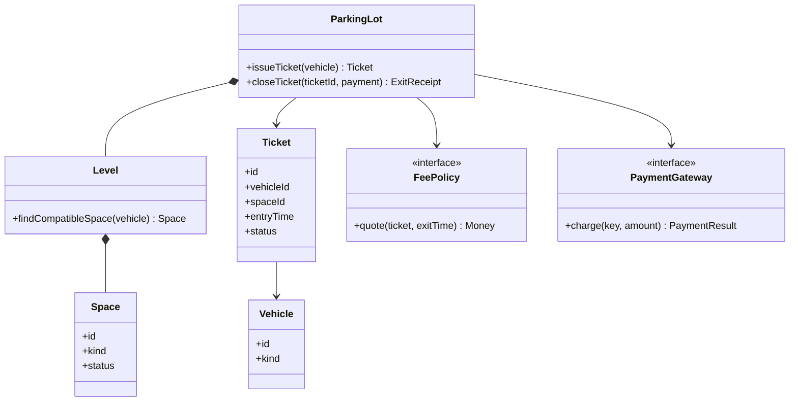
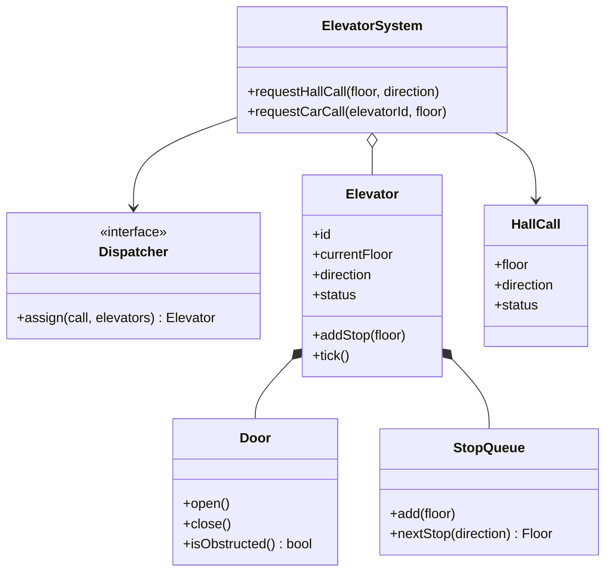
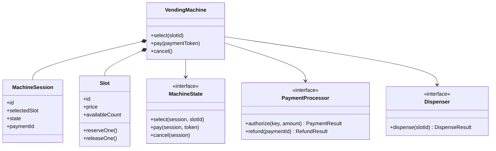
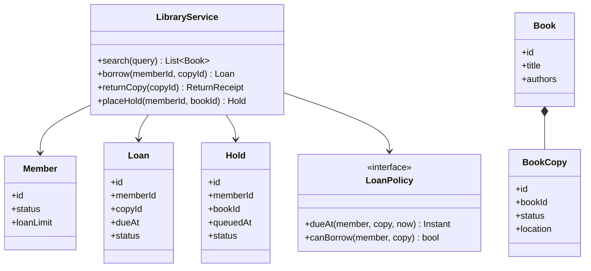
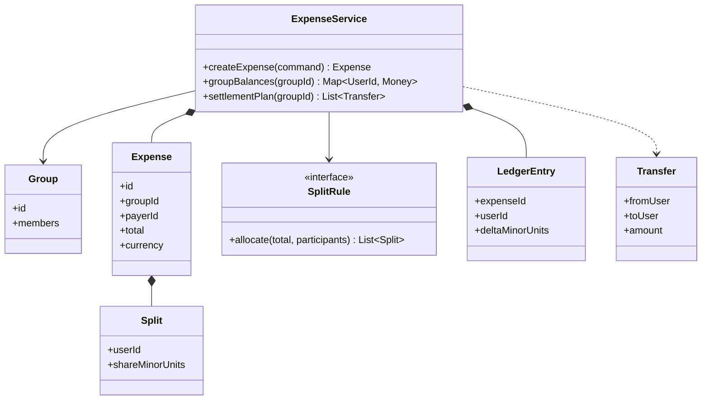
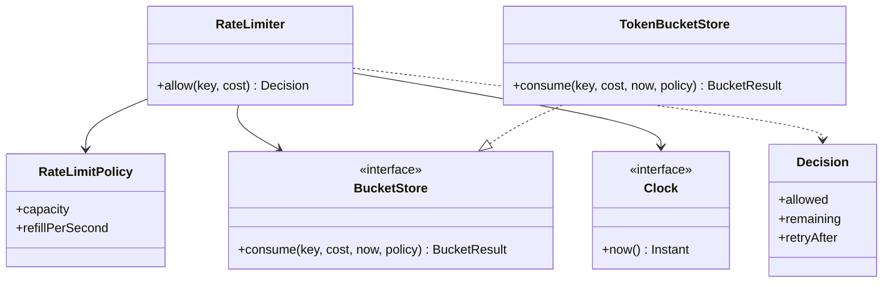
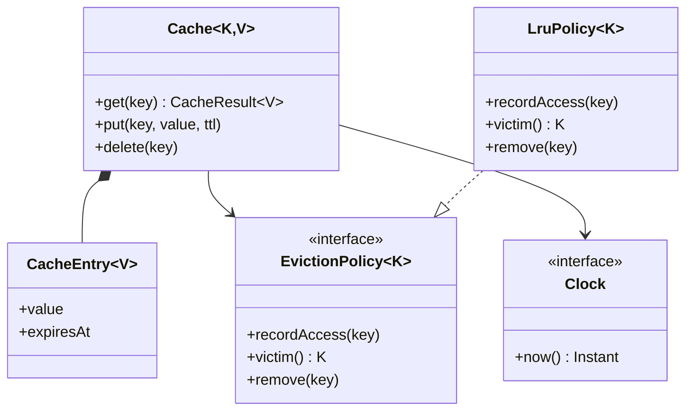
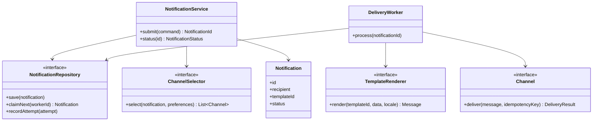
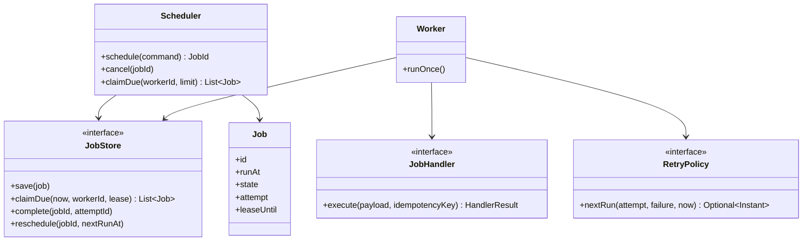

# Low Level Design Interview Preparation

> A practical, senior-level guide to object-oriented and component-level design interviews. It covers a repeatable interview method, language-neutral interfaces and pseudocode, Mermaid diagrams, trade-offs, and nine worked design problems.

## Table of Contents

1. [What Low Level Design Interviews Evaluate](#1-what-low-level-design-interviews-evaluate)
2. [A Repeatable Interview Method](#2-a-repeatable-interview-method)
3. [Design Principles and Modeling Tools](#3-design-principles-and-modeling-tools)
4. [Designing for Concurrency and Failure](#4-designing-for-concurrency-and-failure)
5. [Worked Design: Parking Lot](#5-worked-design-parking-lot)
6. [Worked Design: Elevator System](#6-worked-design-elevator-system)
7. [Worked Design: Vending Machine](#7-worked-design-vending-machine)
8. [Worked Design: Library Management](#8-worked-design-library-management)
9. [Worked Design: Splitwise Expense Sharing](#9-worked-design-splitwise-expense-sharing)
10. [Worked Design: Rate Limiter](#10-worked-design-rate-limiter)
11. [Worked Design: Cache](#11-worked-design-cache)
12. [Worked Design: Notification Service](#12-worked-design-notification-service)
13. [Worked Design: Task Scheduler](#13-worked-design-task-scheduler)
14. [Interview Communication and Practice Checklist](#14-interview-communication-and-practice-checklist)

---

## 1. What Low Level Design Interviews Evaluate

Low Level Design (LLD) interviews ask you to turn a set of requirements into a maintainable design: the important objects or components, their responsibilities, their interfaces, and the way they collaborate. Some interviewers expect class-level detail; others use “LLD” for a component-level design that includes storage, concurrency, and external services. Clarify the expected depth before committing to a model.

Typical evaluation areas include:

- **Requirement discovery:** Do you distinguish core behavior, constraints, and out-of-scope features?
- **Modeling:** Are concepts and state represented clearly, without an oversized “manager” or “god” object?
- **Interfaces:** Can callers express useful operations while implementation details remain encapsulated?
- **Correctness:** Are invariants, state transitions, and failure cases explicit?
- **Changeability:** Can likely variations be added without rewriting unrelated behavior?
- **Communication:** Do you explain choices and trade-offs while leaving time to refine the design?

LLD is not a contest to draw the most classes or apply the most patterns. A small design that meets the stated requirements is usually stronger than a speculative framework. For senior-level discussions, connect local design choices to persistence, concurrency, reliability, and scale where those concerns change the component's behavior. Keep broad deployment topology and capacity planning at the level the interviewer requests.

## 2. A Repeatable Interview Method

Use this sequence as a guide, not a script. Share your reasoning and invite correction before investing in detailed class structure.

### Step 1: Clarify the problem

Ask about users, primary operations, constraints, and expected edge cases. Examples:

- Who calls the system, and what are their main use cases?
- Which behaviors are mandatory for this exercise?
- What scale, latency, consistency, or availability constraints affect the design?
- Are data persistence, external integrations, and concurrent requests in scope?
- Which policy choices are fixed, and which should be configurable?

Write down a small set of functional requirements and important non-functional requirements. Identify non-goals so the model stays bounded.

### Step 2: Define the public operations

List the operations the caller needs. Include inputs, results, and expected errors. This often reveals missing requirements earlier than drawing classes. For example, a reservation API needs a clear answer for “no space available” and for a duplicate request.

### Step 3: Establish invariants and domain concepts

An **invariant** is a condition that must remain true after every valid operation. Examples include “a parking space has at most one active vehicle” and “an expense's shares sum to its total.” Identify the concepts that own these rules.

Model identifiers, values, and state explicitly. Distinguish an entity with identity and lifecycle (such as a reservation) from a value object (such as a money amount or time interval).

### Step 4: Assign responsibilities and dependencies

Give each object one coherent responsibility. Separate policy from mechanism when policies vary. Introduce an interface at a boundary when it enables a concrete need, such as replacing a payment provider, clock, storage implementation, or delivery channel.

Prefer composition for assembling behavior. Avoid both extremes: a single object that owns every rule, and an abstract class for every noun in the prompt.

### Step 5: Draw the core model and walk through one flow

Use a class diagram for static relationships. Use a sequence diagram or concise pseudocode to explain one important operation end-to-end. Walk through the flow in the order calls occur, including validation, state change, and response.

### Step 6: Challenge correctness

Ask what happens with duplicate, stale, invalid, simultaneous, or failed operations. Locate the point where an invariant is protected. If correctness depends on multiple records or services changing together, state the transaction or consistency boundary.

### Step 7: Discuss trade-offs and likely extensions

Name one or two alternatives and why the chosen design fits the stated constraints. Consider how a likely change (a new policy, channel, resource type, or storage backend) would affect the design. Do not add extension points for changes with no plausible requirement.

### Step 8: Summarize

Restate the design's main responsibilities, its key invariant, its main trade-off, and the most important unresolved assumption. A concise summary demonstrates that the model is coherent.

## 3. Design Principles and Modeling Tools

### SOLID in interview designs

| Principle | Practical question to ask |
|---|---|
| Single Responsibility | Does this type have one cohesive reason to change? |
| Open/Closed | Is a real variation point isolated, without making the design speculative? |
| Liskov Substitution | Can an implementation honor the full contract callers expect? |
| Interface Segregation | Does each caller depend only on operations it uses? |
| Dependency Inversion | Do high-level rules depend on stable contracts at replaceable boundaries? |

Other useful habits include encapsulating invariants, using composition over deep inheritance, keeping side effects at clear boundaries, and following the Law of Demeter. **YAGNI** still applies: defer abstractions that do not solve a stated or highly likely problem.

### Patterns as tools

Use a pattern when its intent matches the design pressure:

| Design pressure | Possible tool | Watch for |
|---|---|---|
| Several interchangeable policies | Strategy | The strategy contract should capture a genuine variation. |
| Constructing a complex object in stages | Builder or factory | Keep construction separate only when it has meaningful complexity. |
| A stateful object's behavior changes by state | State pattern or explicit state machine | Ensure invalid transitions are rejected in one clear place. |
| Notify independent subscribers | Observer or event publisher | Define delivery, ordering, and subscriber failure behavior. |
| Translate an external provider API | Adapter | Keep provider-specific details behind the boundary. |
| Wrap an operation with cross-cutting behavior | Decorator | Preserve the wrapped contract and avoid surprising ordering. |

Patterns name trade-offs; they do not replace requirement analysis. A small `switch` can be clearer than a class hierarchy when the set of cases is stable.

### Class, sequence, and state diagrams

- **Class diagrams** show types, ownership, and dependencies; they do not prove behavior is correct.
- **Sequence diagrams** show call ordering and collaboration for a specific flow.
- **State diagrams** help when an entity's legal behavior depends on its lifecycle.

Use composition and multiplicity deliberately. In Mermaid class diagrams, `*--` denotes composition (lifecycle ownership), `o--` denotes aggregation, `-->` denotes a directed association, and `..>` denotes a dependency. Mermaid support varies by renderer, so keep diagrams simple and explain important constraints in text.

### API contracts

For each operation, specify enough to avoid ambiguity:

- Preconditions and validated input.
- Result or domain error.
- Whether retrying the same request is safe.
- State changes and externally visible side effects.
- Ordering or consistency guarantees when relevant.

Prefer domain results such as `ReservationConflict` or `InsufficientFunds` over leaking storage exceptions through the public API. Keep identifiers and money/time values explicit rather than using ambiguous strings or floating-point numbers.

## 4. Designing for Concurrency and Failure

Concurrency and failures matter in LLD whenever two requests can act on the same state or an operation crosses a process boundary.

### Protect invariants at the write boundary

Identify the smallest operation that must appear atomic. For in-memory state, this may be a lock around validation and mutation. For persistent state, it may be a database transaction, compare-and-set, unique constraint, or conditional update. Avoid describing a check and a later write as safe unless their atomicity is explained.

Examples:

- Allocate a space only if it is still available.
- Debit and credit balances in one transaction, or record a durable transfer state that supports recovery.
- Claim a due task once even when multiple workers scan the queue.
- Enforce a rate limit consistently across the scope (process, host, or cluster) that the requirements demand.

### Make retries and side effects explicit

Networks fail after a request may have succeeded. If callers retry, use an idempotency key or a naturally idempotent operation where appropriate. Record durable intent before sending an external message, and consider an outbox or equivalent mechanism when a database update and event publication must stay aligned.

### Keep time and randomness injectable

Use a clock abstraction for expiration, scheduled execution, and time-based tests. Inject random-number generation when behavior depends on randomized backoff or sampling. This improves determinism and exposes hidden environmental dependencies.

### State the failure policy

For each dependency, consider timeout, retry, backoff, circuit breaking, and whether partial success is acceptable. Retries need limits and should be safe for the operation. Do not automatically retry validation errors or non-idempotent actions.

### Be clear about the consistency boundary

“Thread-safe” describes behavior within a process; it does not coordinate multiple processes. Name the scope of coordination and the mechanism that enforces it. If the exercise does not specify distributed deployment, state the assumption and describe the change needed for a multi-instance version without designing an entire platform.

---

## 5. Worked Design: Parking Lot

### Requirements and assumptions

- A lot contains levels and spaces of different vehicle-compatible sizes.
- Drivers enter, receive a ticket, and later pay and exit.
- The system assigns a compatible available space and computes a fee from the ticket's duration and pricing policy.
- A space cannot be assigned to two active tickets. Payment or exit retries must not charge or release twice.
- For this exercise, assume one logical lot service and a configured fee policy; payment processing is an external boundary.

### Core model



`ParkingLot` coordinates the use case. `Space` owns occupancy state; a `Ticket` records the assignment and lifecycle. `FeePolicy` captures pricing variation. `PaymentGateway` adapts an external payment provider. In a multi-entrance deployment, the actual allocation must be protected by a shared atomic reservation mechanism, not only an in-process lock.

### Important flows

```text
issueTicket(vehicle):
    validate vehicle
    atomically reserve one compatible AVAILABLE space
    create ACTIVE ticket with the space and entry time
    if ticket persistence fails, release the reservation
    return ticket

closeTicket(ticketId, paymentKey):
    load ACTIVE ticket
    amount = feePolicy.quote(ticket, clock.now())
    payment = paymentGateway.charge(paymentKey, amount)
    if payment failed: leave ticket and space active
    atomically mark ticket PAID/CLOSED and space AVAILABLE
    return exit receipt
```

The close operation needs a durable state transition and stable payment key so a retry after a timeout can discover the original payment result. In production, model payment-pending/reconciliation explicitly if payment and ticket storage cannot share a transaction.

### Trade-offs and follow-ups

- A scan is simple for small lots; indexed availability by level and space type helps larger lots.
- A single allocation lock is easy to reason about but may become a bottleneck. Partitioning by level can increase concurrency while preserving local exclusivity.
- Follow-ups: accessible or EV spaces, reservations, lost tickets, multiple payment methods, and live occupancy displays.

## 6. Worked Design: Elevator System

### Requirements and assumptions

- Riders request travel from one floor to another.
- Elevators accept hall calls and car calls, move between floors, and report status.
- A dispatcher assigns hall calls; an elevator controller executes movement and door behavior.
- Safety rules override optimization: do not move with doors open, exceed capacity, or serve incompatible directions while moving.
- Assume a fixed building and a simplified deterministic dispatch policy; hardware integration is outside the exercise.

### Core model



Separate dispatch decisions from one elevator's state machine. `Elevator` should validate transitions such as `IDLE -> MOVING -> DOORS_OPEN -> IDLE`; a hardware adapter can implement sensor and motor commands behind a controller boundary.

### Important flows

```text
requestHallCall(floor, direction):
    validate floor and direction
    call = create or reuse unassigned call for (floor, direction)
    elevator = dispatcher.assign(call, available elevators)
    atomically attach call to elevator's stop plan
    return accepted call status

elevator.tick():
    if faulted: stop and report fault
    if doors are open: close only when safe and unobstructed
    else if at a planned stop: open doors, serve matching calls
    else: move one safe step toward next stop
```

### Trade-offs and follow-ups

- A nearest-car policy is easy to explain; direction-aware collective control reduces reversals under normal traffic.
- Stop queues can be ordered by travel direction; destination dispatch can use declared destinations to improve grouping.
- Follow-ups: emergency mode, overload sensor, maintenance, peak-hour policies, fairness, and reassignment after elevator failure. Safety interlocks belong in the controller/hardware boundary and must not depend only on dispatch logic.

## 7. Worked Design: Vending Machine

### Requirements and assumptions

- Customers select an item, pay, and receive the item and any applicable change.
- The machine tracks stock, accepted payment, and dispensing outcome.
- A failed dispense must not silently lose the customer's payment; refunds or reconciliation are possible.
- Assume cashless payment for the main flow; cash handling can be an alternate payment adapter.

### Core model



An explicit state machine prevents invalid operation order. Example states are `Idle`, `Selected`, `PaymentPending`, `Paid`, `Dispensing`, `Completed`, and `NeedsReconciliation`. Keep inventory reservation and session state coordinated so concurrent customers cannot buy the last unit twice.

### Important flow

```text
pay(session, token):
    require session.state == Selected
    reserve one unit from selected slot
    mark PaymentPending with stable idempotency key
    result = paymentProcessor.authorize(key, selected price)
    if declined: release unit; mark Selected; return PaymentDeclined
    mark Paid with provider payment id
    result = dispenser.dispense(selected slot)
    if dispensed: decrement reserved stock; mark Completed
    else: refund or record NeedsReconciliation; do not claim success
```

The real implementation needs durable recovery for a crash between payment and dispensing. A provider webhook or reconciliation job can resolve uncertain payment outcomes.

### Trade-offs and follow-ups

- State pattern can keep a complex lifecycle readable; an enum with guarded transitions may be enough for a small machine.
- Follow-ups: cash/change, age-restricted items, out-of-stock races, refund failures, service mode, restocking, and disconnected operation.

## 8. Worked Design: Library Management

### Requirements and assumptions

- Members search the catalog, borrow available copies, return them, and place holds.
- A title can have multiple physical copies; a hold applies to a title/edition, while a loan applies to a specific copy.
- Due dates, renewals, and overdue fees follow configurable policies.
- Assume a member's eligibility and copy reservation are checked atomically when a loan or hold is created.

### Core model



Separate catalog metadata from copy inventory. Search reads catalog/index data; lending commands enforce copy and member rules transactionally. `LoanPolicy` handles membership tiers or item-specific rules without making `Member` responsible for loan calculations.

### Important flows

```text
borrow(memberId, copyId):
    begin transaction
    lock or conditionally update copy where status == AVAILABLE
    verify member eligibility and active-loan limit
    if a queued hold has priority, assign according to hold policy
    create loan with due date from loanPolicy
    mark copy ON_LOAN
    commit and return loan
```

Returning a copy closes the active loan, calculates any fee, and either assigns the copy to the next eligible hold or marks it available. These related updates should share a transaction or a recoverable workflow.

### Trade-offs and follow-ups

- Normalize title, edition, and copy data for integrity; maintain a search index separately for flexible search.
- Follow-ups: renewals, lost/damaged copies, inter-branch transfers, notifications, digital books, and hold expiration.

## 9. Worked Design: Splitwise Expense Sharing

### Requirements and assumptions

- Users create groups and record shared expenses with participants and a split rule.
- Split types include equal, exact amounts, and percentages; each split must reconcile exactly to the expense total.
- The system computes net balances and suggests a settlement plan.
- Recording an expense changes the ledger; an actual money transfer is a separate payment-provider workflow.
- Store money as integer minor units plus currency, never binary floating-point values.

### Core model



An expense and its splits are immutable facts once recorded, except through an explicit edit/reversal flow. The ledger is the source for balances; do not update a cached balance without also defining how it stays consistent with ledger entries.

### Important flow

```text
createExpense(command):
    validate group membership, payer, participants, currency, and total
    splits = splitRule.allocate(total, participants)
    require sum(splits.shareMinorUnits) == total.minorUnits
    begin transaction
    insert expense and split details with an idempotency key
    append ledger entries:
        payer receives +total
        each participant owes -their share
    commit and return expense
```

For rounding equal splits, distribute leftover minor units deterministically (for example, by stable user-id order) so the sum always equals the total. Balance queries aggregate ledger deltas. A settlement algorithm can repeatedly match debtors and creditors; this minimizes the number of transfers heuristically but is not necessarily the unique or globally optimal solution.

### Trade-offs and follow-ups

- Immutable ledger entries simplify audit and correction through compensating entries; materialized balances make reads cheaper but require replay/reconciliation strategy.
- Follow-ups: multiple currencies, expense edits, group closure, transfer confirmation, privacy, and minimizing transfer count.

## 10. Worked Design: Rate Limiter

### Requirements and assumptions

- Decide whether a request may proceed based on a key such as user, API key, or route.
- Support a configurable limit and time interval, and return useful retry information on denial.
- Make policy and clock controllable for testing.
- Start with a token bucket, which allows short bursts while limiting long-term average rate. State whether enforcement is process-local or shared across service instances.

### Core model



For each key, store available tokens and the time of the last refill. Refill by elapsed time, cap at capacity, then consume cost if enough tokens remain. A distributed implementation needs an atomic read-refill-check-write, commonly implemented by a server-side script or atomic datastore operation.

### Important flow

```text
allow(key, cost):
    require cost > 0 and cost <= policy.capacity
    now = clock.now()
    result = bucketStore.consume(key, cost, now, policy)  // one atomic operation
    if result.allowed: return Allowed(result.remaining)
    return Denied(retryAfter = result.timeUntilEnoughTokens)
```

### Trade-offs and follow-ups

- Fixed window is simple but permits boundary bursts; sliding log is precise but stores more events; sliding counter approximates the latter; token bucket permits controlled bursts.
- Define behavior when the shared store is unavailable: fail open, fail closed, or use a bounded local fallback, based on endpoint risk.
- Follow-ups: hierarchical limits, dynamic policy updates, key eviction, clock skew, metrics, and fairness.

## 11. Worked Design: Cache

### Requirements and assumptions

- Provide `get`, `put`, and `delete` for keys and values.
- Support a capacity bound, expiration, and a documented eviction policy.
- Start with an in-process LRU cache that is safe for concurrent callers.
- Cache misses are distinct from a cached null-like value; use an explicit result type.

### Core model



An LRU policy can use a hash map from key to a doubly linked list node plus a list ordered by recency. `Cache` owns storage and synchronizes changes; `EvictionPolicy` captures replacement behavior. TTL checks should use a monotonic time source when available.

### Important flow

```text
get(key):
    lock cache
    if key absent: return Miss
    if entry expired at clock.now(): remove entry and return Miss
    evictionPolicy.recordAccess(key)
    return Hit(entry.value)

put(key, value, ttl):
    lock cache
    insert/update with expiration
    evictionPolicy.recordAccess(key)
    while size > capacity:
        remove evictionPolicy.victim()
```

This coarse-lock version favors clarity. For higher contention, shard by key or choose a concurrent cache design, while being explicit about eviction accuracy and per-shard capacity.

### Trade-offs and follow-ups

- Lazy expiration on access is simple; a background sweeper prevents expired entries from occupying capacity indefinitely.
- Define whether values are copied, immutable, or shared; shared mutable values can bypass cache synchronization.
- Follow-ups: write-through/write-back, cache stampede protection, negative caching, size-based capacity, distributed invalidation, and metrics.

## 12. Worked Design: Notification Service

### Requirements and assumptions

- Callers submit a notification to one or more recipients with a message and delivery preference.
- Channels such as email, SMS, and push use different providers.
- Delivery is asynchronous, retriable, and observable; duplicate delivery should be reduced through stable message and attempt identifiers, while acknowledging that external providers may not guarantee exactly-once delivery.
- Assume durable queueing and worker execution are in scope at the component level.

### Core model



The submission path validates, stores durable intent, and returns an identifier. Workers claim due work, render content, call a channel adapter, and record the outcome. A channel is an adapter for a provider; channel selection is a policy and can account for user preferences, locale, and urgency.

### Important flow

```text
submit(command):
    validate recipient, template, and permission to send
    begin transaction
    save notification as QUEUED with stable id
    write outbox event for worker queue
    commit
    return notification id

worker.process(id):
    claim queued or retry-due notification with a lease
    select eligible channel and render message
    record attempt as IN_PROGRESS
    result = channel.deliver(message, key = notificationId + channel)
    record DELIVERED, RETRY_SCHEDULED, or PERMANENT_FAILURE
```

Use bounded exponential backoff with jitter for transient failures, a maximum attempt/age policy, and a dead-letter or review path. Treat provider callbacks as duplicate and potentially out-of-order events.

### Trade-offs and follow-ups

- Persisting the outbox alongside the notification avoids losing work between database commit and queue publication.
- Define whether channel fallback can send duplicates if the first provider's result is uncertain.
- Follow-ups: rate limiting per recipient, quiet hours, consent, template versioning, delivery receipts, prioritization, and privacy of message content in logs.

## 13. Worked Design: Task Scheduler

### Requirements and assumptions

- Clients submit one-time or recurring jobs with a scheduled time and payload.
- Workers claim due jobs, execute handlers, and record success or failure.
- Support retries and prevent two workers from owning the same active attempt.
- Assume persistent job state and at-least-once execution; exactly-once effects require idempotent handlers or deduplication at the effect boundary.

### Core model



Jobs move through states such as `SCHEDULED`, `RUNNING`, `SUCCEEDED`, `FAILED`, and `CANCELLED`. Claiming must atomically set a lease and attempt identifier. A worker whose lease expired must not overwrite a newer attempt's result; use a fencing token or compare-and-set on attempt identity.

### Important flow

```text
worker.runOnce():
    jobs = jobStore.claimDue(clock.now(), workerId, leaseDuration)
    for job in jobs:
        try:
            handler = handlerRegistry.forType(job.type)
            result = handler.execute(job.payload, idempotencyKey = job.id)
            jobStore.complete(job.id, job.attemptId)
        catch failure:
            next = retryPolicy.nextRun(job.attempt, failure, clock.now())
            if next exists:
                jobStore.reschedule(job.id, next, expectedAttempt = job.attemptId)
            else:
                jobStore.fail(job.id, expectedAttempt = job.attemptId)
```

Recurring jobs should compute the next occurrence from an explicit schedule/time-zone policy. Decide whether missed runs are skipped, coalesced, or replayed after downtime.

### Trade-offs and follow-ups

- A due-time index or time wheel can support efficient scheduling; a simple ordered query is easier at low volume.
- Leases recover from crashed workers, but lease duration and heartbeat policy affect duplicate work and recovery time.
- Follow-ups: priorities, tenant fairness, cancellation after claim, long-running jobs, workflow dependencies, poison tasks, and scheduler failover.

## 14. Interview Communication and Practice Checklist

### How to present the design

- Start with the user-visible behavior and clarify assumptions out loud.
- Sketch only the central types first; label relationships and ownership.
- Walk through one high-value operation, naming each validation and state change.
- State the invariant and point to the transaction, lock, or conditional update that protects it.
- Call out one trade-off and one plausible evolution path.
- Invite the interviewer to choose a deeper area instead of guessing every possible requirement.

### Common pitfalls

- Coding immediately without agreeing on requirements or operation contracts.
- Treating every noun as a class and every variation as inheritance.
- Putting all behavior in a manager/service class with no domain ownership.
- Omitting lifecycle states, invalid transitions, duplicate requests, and concurrent updates.
- Claiming exactly-once delivery or execution across a network without explaining the mechanism and limits.
- Using floating-point values for currency or wall-clock time for elapsed-time calculations.
- Adding microservices, caches, or patterns that do not solve a stated problem.
- Drawing a diagram but failing to explain a key flow or failure path.

### Final checklist

- [ ] Core use cases and non-goals are clear.
- [ ] Public operations have inputs, results, and domain errors.
- [ ] Important entities, value objects, and ownership relationships are explicit.
- [ ] Invariants are stated and protected at a clear boundary.
- [ ] One success flow and at least one failure or retry flow are understandable.
- [ ] Concurrency and persistence assumptions are named.
- [ ] Interfaces exist at real policy or external-system boundaries.
- [ ] Trade-offs are explained without overbuilding the design.
- [ ] The design can be summarized in a few sentences.

